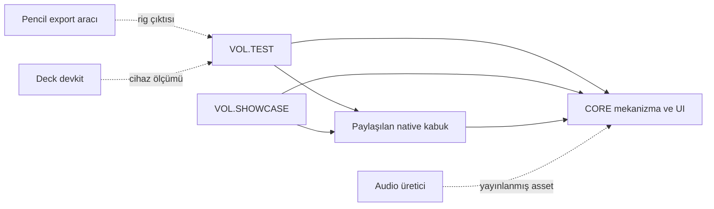

# VOL.STUDIO — güncel monorepo denetimi

**Tarih:** 2026-10-09. **Temel:** `251c3db4`, `feature/core-hardening`;
B21–B30 uygulaması bu teslimdeki kaynak ve regresyonlardır.
F04 teslimi `cab83d7e` sonrasında 81 commit incelendi. Bu rapor kaynak kodu,
oturum başındaki beş yerel değişikliği ve önceki cihaz kayıtlarını ayırır.
Bugünkü karar burada; ayrıntılı tarihçe git'te, işlerin sahibi
[kök TODO](../TODO.md), UI alt işlerinin sahibi [UI TODO](ui/TODO.md)'dur.

## 1. Açık hüküm

Repo ciddi biçimde ilerledi. Windows geçişi artık yalnız yol ayırıcı yaması
değil: çalışan MSVC probu, süreç/argv sözleşmeleri, gerçek disk testleri ve
native kayıt turu var. CORE UI'ın yeni kimliği kaynakta, vitrinde ve oyunda
tüketiliyor. Audio hedef kilidi, manifest doğrulaması ve fizik kesişimi
düzeltmeleri gerçek; yalnız belgeye yazılmış işler değiller.

**Buna rağmen bütün ürün kabulleri tamamlanmış değildir.** B21–B30'un
on kod kusuru kaynak ve regresyonla düzeltildi; kapanış zinciri, gerçek
tüketici ve dosya/süreç sınırları birlikte sınandı (§4). Bağımsız incelemenin
yakaladığı geç mini harita montajı ve sayaçsız eski Deck kaydı da çözüme alındı.

Belge yolu kusuru giderildi; bundle farkı özellik maliyetiyle ayrıştırıldı.
Güncel birleşik kapının kanıtı §6/§17'dedir. JS güvenlik advisory'leri ve
fiziksel/native ürün kabulleri açık kalır. Teknik kapanış bir insan
beğenisi bekleme durumu üretmez; yapılmayan cihaz kabulü de PASS sayılmaz.

Mimariyi topluca yıkmak için kanıt yok. Öncelik yeni mekanizma yazmaktan
önce mevcut mekanizmaların **birlikte çalıştığı** senaryoları güvenceye almak.
En büyük açık artık parçaların varlığı değil, parçaların birleşimidir.

## 2. Yöntem ve kanıt standardı

Önemli iddialar belge/TODO → uygulama kaynağı → gerçek tüketici → testin
assert ettiği durum → uygun disk/süreç/cihaz kanıtı zinciriyle sorgulandı.
Kalıcılık/native, oyun/simülasyon ve UI/audio/Pencil bağımsız incelendi;
ana denetçi kusur tekrarlarını ayrıca çalıştırdı. İnceleyici kanaati tek
başına bulgu sayılmadı.

Her test dosyasındaki her assertion tek tek elle incelenmiş değildir.
Tam takımlar çalıştırıldı; yüksek riskli sahiplik, gerçek tüketici,
geometri ve yayın sınırları kaynaklı tekrarlarla derinleştirildi. Bu rapor
eksiksiz kusursuzluk garantisi veya yalnız kapsama dayalı puanlama değildir.

Bazı tekrarlar yanlış davranışı assert ederek exit 0 verir; bu **ürünün
PASS olması değildir**. Oyun tekrarında olması gereken davranışı bekleyen
üç assertion kırmızıdır. Kanıtlar git dışındaki yerel audit alanındadır.
Ham cihaz adresi, seri, oturum kimliği veya kişisel ekran içeriği bu belgeye alınmadı.

Fallow statik tarama ve Graphify query/affected kullanıldı. Eski grafın
vol-ui yolları verdiği görüldü; yerel, LLM gerektirmeyen kod update'i yapıldı
ve bağlantılar güncel kaynakla doğrulandı. Graphify iki TypeScript barrel'ında
parser sınırlaması bildirdi; bunlar typecheck hatası değildir. `.pen`
dosyaları okunmadı; Pencil tekrarında yalnız yapay PNG/manifest kullanıldı.

| Kanıt                         | Neyi gösterir?                             | Neyi göstermez?                         |
| ----------------------------- | ------------------------------------------ | --------------------------------------- |
| Kaynak + deterministik tekrar | Tetikleyici ve yanlış sonuç                | Cihazdaki oluşma sıklığı                |
| Otomatik kapı                 | Belirtilen komutun bu ağaçtaki sonucu      | Sınanmayan davranışın doğruluğu         |
| Gerçek cihaz otomasyonu       | Belirtilen cihaz/yazılım yolunun çalışması | İnsan girdisi, panel fotonu ve hissiyat |
| Önceki kayıt                  | Belirtilen commit/runtime referansı        | Değişmiş paketin bugünkü kabulü         |
| Açık/NOT-RUN                  | Kabul yapılmadı veya eşlenemedi            | PASS ve destek ilanı                    |

## 3. Mimari ve ölçek

| Paket                    | Gerçek rol                                      | İzlenen dosya | Src dosyası¹ | Test dosyası² |
| ------------------------ | ----------------------------------------------- | ------------: | -----------: | ------------: |
| `core/`                  | Saf mekanizma, sunum, opt-in tarif, UI kataloğu |         1.050 |          313 |           201 |
| `tauri-v2/`              | Ortak JS/Rust kabuk ve platform adaptörleri     |           176 |           16 |            20 |
| `games/vol-test/`        | CORE/kabuk tüketen gerçek tank oyunu            |           353 |           99 |            76 |
| `devtools/vol-showcase/` | UI vitrini ve native kanıt uygulaması           |           190 |           39 |            88 |
| `devtools/audio-synth/`  | Deterministik üretim ve teknik yayın            |         2.402 |          260 |           132 |
| `devtools/pen.dev/`      | Pencil export düzenleme ve rig sözleşmesi       |            88 |            2 |             2 |
| `devtools/deck/`         | Devkit CLI, sonda ve cihaz otomasyonu           |            30 |            0 |             4 |

¹ Paketin src ağacındaki TS/TSX/RS/KT/JS/CSS; native alt ağaç ve scripts ayrıca
sayılmaz. ² tests ağacındaki test/spec adları; E2E ve birim dosyası birlikte
sayılır. Dosya sayısı test kalitesi değildir.

Toplam 4.475 izlenen dosya, yedi aktif paket; frozen paket yok. `cab83d7e`
sonrası 197.847 eklenen / 13.415 silinen satırın önemli bölümü ses manifesti
ve asset verisidir. Bunlar aynı büyüklükte uygulama kodu veya mimari başarı sayılmaz.

Bağımlılık yönü sağlıklı: CORE oyun/devtool import etmez; oyun CORE/kabuk
ve dış bağımlılıkları tüketir; devtool oyun runtime bağımlılığı değildir.
Güncel workspace contract yedi paketin kapı kapsamını, katmanlarını,
kaynak girdilerini ve dosya boyutlarını geçti. Saf simülasyon CORE alt
yüzeylerine, Phaser sunumu köprülerine, native context ürün crate'ine ayrılmış.

Düz ok runtime tüketimini, kesikli ok varlık/ölçüm akışını gösterir;
devtool'un oyunun runtime import'una dönüşmesi değildir.

Üç gerçek akış tasarımın durumunu anlatır:

- Açılış: servis oluşturma → scoped kayıt göçü → ayar/durum yükleme → oyun
  ve HUD. Yeni LoadingScreen bu gerçek zincirin tüketicisidir.
- Kapanış: oyunu duraklat → servisleri flush et → sonuçları topla → native
  ACK → çıkış. B22 düzeltmesi native sorguyu da kuyruğa alır; görüntü niyeti ayar yazımından önce yerleşir.
- UI: bileşen niyeti → en yakın UI kökü → ses/haptik sağlayıcısı → skin
  asset'i. B24 düzeltmesi fiziksel DOM olayını en yakın kayıtlı köke bağlar.

## 4. B21–B30 kök neden çözümleri

On bulgunun kaynak kusuru kapalıdır. Önce doğru sonucu bekleyen regresyon
eski davranışta kırmızı görüldü; sonra çözüm aynı testte doğrulandı.
Bu tablo cihaz desteğinin tamamını veya F07'nin bütün ailesini kapatmaz.

| Bulgu   | Kök çözüm                                                                                                                                                                                                                                                           | Regresyonun somut sınırı                                                                                                                                                                                           |
| ------- | ------------------------------------------------------------------------------------------------------------------------------------------------------------------------------------------------------------------------------------------------------------------- | ------------------------------------------------------------------------------------------------------------------------------------------------------------------------------------------------------------------ |
| B21, P1 | [Pencil düzenleyici](../devtools/pen.dev/scripts/organize-pen-export.mjs) yalnız manifest kaynağını tüketir; staging yalnız boşsa kaldırılır. Örtüşme ve symlink/junction preflight reddidir.                                                                       | Gerçek geçici disk; ilgisiz PNG/alt dizin korunumu, ardışık export, örtüşme ve rollback.                                                                                                                           |
| B22, P2 | [Görüntü sahibi](../tauri-v2/src/window/DisplayModeController.ts) native sorguyu da kuyruğa alır; await sonrası generation/destroy denetler. [GameServices](../games/vol-test/src/app/GameServices.ts) önce görüntü niyetini, sonra ayar/ilerleme flush'ını bekler. | Bekleyen toggle→tercih→kalıcı son snapshot; destroy sonrası geç sorgu etkisiz. Görüntü reddi diğer kayıtları boşaltmayı engellemez.                                                                                |
| B23, P2 | [Reporter](../tauri-v2/src/platform/diagnostics.ts) IPC reddini, [native append](../tauri-v2/plugins/vol-diagnostics/src/lib.rs) açma/yazma/sync hatasını Result ile taşır. Oyun hata sınırı güvenli yakalar; ölçüm kaybı sayaçta görünür.                          | Gerçek reporter + GameMeasurements, gerçek disk success/open/mkdir reddi. Deck kayıp/eksik pencere/sayaçsız phase'i reddeder; Android eksik kanıtta FPS üretmez. Hata metni yerel dosya yolu taşımaz.              |
| B24, P2 | [UiIntentBus](../core/src/ui/feedback/uiIntent.ts) fiziksel olayın en yakın kayıtlı kökünü doğrular; özel handler da dış köke yeniden atfedemez.                                                                                                                    | İç kök, dış fallback, dış custom handler; olay hedefi olmayan host sinyali korunur. Gerçek Ses sekmesinde dry/kit dinletimi ikinci sesi üretmez.                                                                   |
| B25, P2 | [UiSoundKit](../core/src/audio/ui/UiSoundKit.ts) restore jenerasyonunu ve değişen alanları izler; dokunulmamış alanı yükler, son birleştirilmiş snapshot'ı kaydeder.                                                                                                | Restore sürerken mute/master değişimi; eski restore, dispose ve kalıcı son snapshot. Yalnız callback sırası değil adapter çıktısı sınanır.                                                                         |
| B26, P2 | [MinimapPanel](../core/src/ui/hud/MinimapPanel.ts) bağlıyken yalnız ata tema attribute/direct childList izler; detached aşamasında montajı keşfedip dar gözleme döner.                                                                                              | Durağan haritada scoped tema, aynı task'ta taşıma, ilk kareden sonra ilk mount ve ayrı task'ta remount; destroy sonrası observer/RAF temizliği. Sürekli polling veya bağlı panelde subtree attribute taraması yok. |
| B27, P2 | [Projectiles](../games/vol-test/src/sim/combat/Projectiles.ts) adım segmentini ilk dünya çıkış parametresinde keser; duvar arkasındaki araç aranmaz.                                                                                                                | Yedi bağımsız konum fixture'ı, sınırdan içe uçuş, duvarın ön/arkasındaki hedef, gerçek balistik hız ve gerçek Simulation tank atışı. x=1000/y=505 beklentisi preview paritesinden türetilmez.                      |
| B28, P3 | Mini harita label sağlayıcısı dil değişiminde yeniden okunur; [oyun tüketicisi](../games/vol-test/src/hud/MapPanel.ts) canlı i18n sağlayıcısı verir.                                                                                                                | CORE harita, oyun MapPanel ve gerçek HUD dil geçişi; görünen başlıkla canvas erişilebilir adı birlikte değişir.                                                                                                    |
| B29, P3 | [Kapı raporu](../scripts/quality/report.mjs) failing TAP bloğunu ayrıştırır; belirsiz paket null kalır.                                                                                                                                                             | Önceki PASS paketi yanlış atfedilmez; multiline YAML sebep/yol, gerçek CLI JSON ve exit/raw log korunumu.                                                                                                          |
| B30, P3 | [Preview sahibi](../devtools/vol-showcase/scripts/device-preview.mjs) Vite'ı doğrudan Node çocuğu olarak açar; kendi stdout'u ve HTTP hazır olmadan kabul etmez.                                                                                                    | Gerçek Windows Vite ardışık turunda PID/port kapanışı, dolu port sahibinin korunumu, erken exit; kapanış sınırlı bekler ve başarısızsa reddeder.                                                                   |

İki bağımsız inceleme düzeltmesi de aynı bulgunun parçasıdır; yeni açık
checkbox defteri oluşturulmadı. B27 süpürülmüş doğru parçası modelini
düzeltir; eğri uçuşun veya hareketli hedefin tam sürekli CCD'si vaat edilmez.
Native pencere test harness'inin Windows DLL giriş sorunu nedeniyle Rust
yazım regresyonu UI mock üzerinden değil gerçek tempdir fonksiyonuyla kuruldu.

## 5. Statik araçların doğru yorumu

Fallow 3.31.0, 1.469 dosya / 20.098 fonksiyon analiz etti. Dead-code taraması
487 sinyal bildirdi: 110 dosya, 200 export, 57 tip, 108 sınıf üyesi, bir
bağımlılık, iki çözülemeyen import ve dokuz çift export. Döngü bildirmedi;
duplication yaklaşık %2. Bu **487 doğrulanmış hata değildir**.

Bilinçli UI kataloğu, CLI girişleri, subprocess fixture'ları, üretilen
vendor dosyaları ve library API'si import grafında eksik görünebilir. CORE
scaling/debug bağımsız girişler; Deck frame-summary vendor'u üreticiden
oluşur. Silme için gerçek giriş/üretici/tüketici zinciri gerekir.

Health coverage_model static_estimated'dır; gerçek V8 kapsamı sayılmadı.
Boundary/rule-pack yapılandırması yok; o alanlardaki sıfır **ölçülmemiştir**.
Repo katman AST bekçisi ayrıca geçti. Graphify update 13.200 kod düğümü /
40.341 kenar bildirdi; belge/görsel semantiği yeniden çıkarılmadı. Kaynak
doğrulaması, parser sınırı ve kesilmiş query çıktısı önemini korur.

Bakım inceleme sırası: kalite config validator'ı (siklomatik 68, bilişsel
171), public type yüzeyi, katman bekçisi, WorldScene, music engine, Select.
Kalite betikleri yoğun değişen yüksek sorumluluklu alanlar oldu. Refactor
amacı sayıyı küçük fonksiyonlara dağıtmak değil, kural sahibini ve negatif
fixture'ları anlaşılır kılmak olmalı. Statik “test ekle” önerisi mevcut
testler okunmadan eksik test kanıtı değildir.

Yanlış alarm olarak elenenler de önemlidir: callback handle sahibi artık
gerçektir; hidraw darbe süresi native tarafta beklenir; geniş Steam Cloud
izni mevcut devkit tüketicisi görülmeden kusur sayılamaz. Yalnız bool dönüş
tipine bakılarak Steam Input init başarısızlığı ileri sürülmedi. Kullanılmayan
genel resolution API'si gerçek oyunda hata var diye yükseltilmedi.

## 6. Güncel kapılar ve bundle

Güncel birleşik **pnpm high PASS**: contract, biçim, tip, lint,
build, Rust, CSS, coverage/shape, audio alt kümesi, bundle, scaling ve
iki motorlu E2E aynı sabit kaynak ağacında tamamlandı. Contract 414 PASS /
2 mevcut platform skip; eşik, timeout ve skip politikası gevşetilmedi.
JS güvenlik kapısı ayrıca yeniden koşuldu: 2 high / 1 moderate ile FAIL.
Bu nedenle **signoff PASS değildir**; advisory sahipliği F10.1'de açık.

Temiz frontend build, gzip level 9:

| Paket        |       App |    Vendor |      CSS | App bütçesi |
| ------------ | --------: | --------: | -------: | ----------: |
| VOL.SHOWCASE | 182,4 KiB |         0 | 28,8 KiB |   182,9 KiB |
| VOL.TEST     | 120,4 KiB | 345,6 KiB | 26,1 KiB |   120,9 KiB |

Eski vitrin sınırı 178,7 KiB yeni kare ölçüm aracını eksik bütçeliyordu.
Kontrollü build'de yalnız frameBenchController çıkarılınca 182,3→180,0
KiB ölçüldü: faydalı ölçüm özelliğinin 2,3 KiB maliyeti var. Bu sanal
probe yalnız yerel çıktı üretti; üründen özellik kaldırılmadı.
251c3db4 yeniden ölçümü 182,0 idi. Bu düzeltmenin ek maliyeti vitrinde
0,4 KiB, oyunda 0,6 KiB: ilk duvar teması, ekran kuyruğu, tanı hata
sınırı ve canlı mini harita dil/tema sahipliği. quality.json geçmiş
günlüğü tek güncel gerekçeye indirgendi; app bütçesinde 0,5 KiB pay var.
Vendor/CSS ve kapsam eşikleri değişmedi. Uygulama kodu vendor adıyla
ölçümden saklanmadı. Gzip boyutu FPS/native açılış/OGG toplamı değildir.

theme.css bütünü stylelint seçimi dışında; AST/parite/kontrast kapısı
üretilen bölgeleri denetler, dosyanın el yazımı bütün CSS'inin stylelint
kabulünü sağlamaz. Bu denetimde bozuk CSS gösterilmedi; güvence daralması
F10.3'te gerekçesi ve negatif fixture'ıyla sorgulanmalı.

Vitrin build'i ortak public ağacını da taşır: 150 OGG 812.111 bayt, üç TTF
864.900 bayt, 136 SVG 184.921 bayt. JS/CSS gzip kapısı bu varlıkları ölçmez.
Bu dosyalar indirme/preload ve native paket boyutunda ayrıca görünür olmalı;
tümünün ilk kare öncesi indirildiği veya gereksiz olduğu gösterilmedi.

E2E tek başına 776,6 saniye sürdü. UI TODO'daki hızlı smoke/tam ui-check
ayrımı mevcut justfile'a henüz uygulanmadı; high hâlâ tam browser takımını
koşuyor. Bu kaliteyi düşürme gerekçesi değildir; geliştirici çevriminin gerçek
maliyetidir. Kapsamı kanıtlı ayırmak ile testi sessizce kaldırmak farklıdır.

### Güvenliğin gerçek kapsamı

Yerel audit ve gerçek lock zinciri üç JS advisory gösterdi:

| Paket / kurulu sürüm          | Seviye   | Doğrulanan karar                                                                             |
| ----------------------------- | -------- | -------------------------------------------------------------------------------------------- |
| braces 3.0.3                  | High     | Audit önerisi 3.0.4 registry'de yok; GitHub kaydı patch yok diyor. Hayalî override yapılmaz. |
| source-map-js 1.2.1           | High     | 1.2.2 gerçekten yayımlanmış; uyumlu transitive güncelleme/regresyon adayı.                   |
| postcss-selector-parser 7.1.4 | Moderate | 7.1.6 gerçekten yayımlanmış; uyumlu Stylelint zinciri/regresyon adayı.                       |

Kaynaklar: [braces advisory](https://github.com/advisories/GHSA-vfj7-8cjw-p6xm),
[source-map-js advisory](https://github.com/advisories/GHSA-68fv-2mgg-jv7q),
[selector-parser advisory](https://github.com/advisories/GHSA-rj75-hqrm-r3gf).
İlkinde audit'in patched alanıyla registry/primary kayıt çatışması ayrıca
çapraz denetlendi. Diğer ikisinde önerilen sürüm metadata sorgusunda mevcut.
Bu tur bağımlılık/lock değiştirilmedi; güncelleme yapılmış sayılmaz.

Görülen yollar Stylelint/Vite/PostCSS/Vitest araç zincirindedir. Advisory'nin
saldırgan girdisi şartı ile ürünün gerçek erişilebilirliği ayrılmalı;
bu rapor oyun içinde uzaktan sömürü kanıtı sunmaz. Güvenilir kaynakla
build-time CSS kullanımı selector advisory'sinin uzaktan istek senaryosu
değildir. Yine de mevcut güvenlik kapısı kırmızıdır; sonuç saklanmaz.

Rust 470 kilitli bağımlılığı taradı, exit 0 verdi; dokuz allowed warning
risksiz kabul değildir. glib 0.18.5'in
[VariantStrIter unsound advisory'si](https://rustsec.org/advisories/RUSTSEC-2024-0429)

> =0.20.0 düzeltmesini gösterir; Tauri/GTK zincirine tek sürüm override'ı
> uyum kanıtı olmaz. Yedi bakımsız crate ve bir yanked sürümün sahibi,
> hedef platform ve erişilebilirliği F10.1'de açık kalır.

## 7. Yüksek kapsamın kaçırdığı şey

| Paket       | Statement | Branch | Function |   Line |
| ----------- | --------: | -----: | -------: | -----: |
| CORE        |    %94,10 | %86,81 |   %94,98 | %95,93 |
| pen.dev     |      %100 |   %100 |     %100 |   %100 |
| tauri-v2 JS |    %97,40 | %92,97 |     %100 | %99,16 |
| Vitrin      |    %94,98 | %71,03 |   %87,70 | %95,62 |
| VOL.TEST    |    %98,78 | %94,26 |   %97,44 | %99,33 |
| Audio synth |    %96,10 | %89,12 |   %97,77 | %96,85 |

Tablo güncel high kapsamıdır; audio synth ayrı audit koşusudur (§17).
Denetim başlangıcında kusurların ilgili dar testleri de yeşildi: CORE 229, Pencil 27, audio protocol
30, native/oyun hizmetleri 101, oyun fizik/HUD 43. Bunlar benzersiz toplam
test sayısı değildir; bazı dosyalar tekrar koşuldu. Kanıt, mevcut testlerin
bu birleşimleri kaçırmasıdır. Yeni regresyonlar bu sınır çiftlerini kapatır;
yüzde tek başına doğruluk kanıtı sayılmaz. Aşağıdaki eski beklentiler bu teslimde düzeltildi.

- Doğru test, yanlış bağlantı: GameMeasurements fake reporter'la kayıp
  sayar; gerçek reporter hatayı yuttuğunda birleşim yanlış olur.
- Yanlış başarı beklentisi: temiz staging'in tamamı silinsin beklenir;
  ilgisiz dosya korunumu sözleşmede yoktur.
- Parite doğruluk sanılır: preview/runtime aynı yanlış duvar noktasında
  uzlaşır. Geometrik ilk temas için bağımsız oracle gerekir.
- Sıralı test yarış sanılır: restore/setSettings veya F11/destroy ayrı
  geçer; bekleyen iş sırasında kullanıcı/yaşam değişimi sınanmaz.

Çözüm genel timeout veya kapsam istisnası artırmak değildir. Gerçek
reporter/kabuk/tüketici bileşimi ve kritik sahiplik koşulunu kaldırınca
kırılan regresyon gerekir. Bütün kombinasyonları şişirmek yerine riskli
sınır çiftleri seçilmeli.

Headless testi DOM/CSS bağımsızlığını ve aynı seed'in son pozlarını
kanıtlar; bütün event/weather geçmişinin golden kilidi değildir.
CombinedLoad 36.000 adım, simüle edilmiş on dakika; gerçek cihaz soak veya
heap büyümesi ölçümü değildir. Scaling oranı mutlak kare süresi değildir.

## 8. Mimari borç ve karar

CORE mekanizma/sunum/tarif ayrımı korunmalı. Registry'deki 148 kaydın 61'i
tier-1, 87'si tier-2; katalog sahibi tüketicisiz API otomatik ölü kod
değildir. Katalogda görünmek de klavye/kol/dokunma/AT/lifetime kabulü değildir.

GameServices startup göçü ve shutdown flush'ını görünür kılan doğru
composition root oldu. Yeni servis eklendiğinde başlatma sırası ve kapanış
niyeti birlikte test edilmeli. Kayıt, ses, görüntü ve ölçüm aynı çıkışta yarışır.

Native kabuk app değildir; context/plugin/izin üründe yaşar. Android
orientation/haptics üçlü bağı ve Steam callback guard/pump/drop sahibi
mevcut. Windows/Android native sleep watcher bilinçli noop; görünürlük/
autosave Linux logind uyku bariyeri diye anlatılamaz.

İkincil borç: orientation applySaved açılış çağıranı yok; oyun sonradan
landscape uygular. Kullanılmayan setResolution yolu center iznine ihtiyaç
duyabilir; gerçek oyun tüketicisi olmadığından ürün kusuru diye yükseltilmedi.
Template'de tüketicisiz allow-close artığı mevcut ürün temizliğini izlememiş.
Bunlar F09.4 yeni oyun kabulünde ele alınmalı.

SpatialIndex refresh bütün iterable'ı tarar: O(N) kontrol + hücre değiştiren
öğeler kadar yapısal mutasyon. Yorum taramayı da ortadan kaldırmış gibi
anlatmamalı. Yeni algoritma hatası bulunmadı. Quadtree veya worker'a sırf
daha sofistike göründüğü için geçmek mevcut ölçümle desteklenmiyor.

## 9. Windows desteğinin dürüst durumu

**Windows'ta geliştirmeye devam etmek için temel sağlam.** Doctor bu tur
Node 22.23.1, pnpm 11.18.0, Rust/Cargo 1.99.0, gerçek MSVC link+run,
Git Bash/just/FFmpeg ve iki paketin Chromium/WebKit kurulumunu geçti.
Typecheck, lint, frontend build, Rust ve kapsam çalıştı.

Önceki native-store-tour gerçek Windows ürününde 15/15 kayıt/göç/bak/
karantina/kurtarma bildirimi/WM_CLOSE ve beş sert öldürme turunu kapsar.
Kaynak/test/yerel tur zinciri Fedora geçişinin yüzeysel yamadan ileri
gittiğini gösterir. Bu tur native store turu yeniden koşulmadı; bugünkü
B22 gibi yeni yarışların kabulü eski turdan türetilmez.

Eksik kabul: NSIS kurulum/kaldırma, DPI 125/150/200, WebView2 sunum,
OGG/clipboard/metin/gerçek kol ve paketli uzun oturum. Çalışan geliştirme
hostu tam ürün matrisinin kabulü değildir. Bugünkü kanıtlı günlük akış
engelleri belge contract ve vitrin bundle'dır; ortamı baştan kurmak veya
Linux'a geri dönmek için kanıt yok.

## 10. Deck ve Android: cihazla çapraz kontrol

Lenovo TB350FU / Android 14 erişilebilir. Güncel frontend build tablette
Chrome/CDP ile portre/yatay koşuldu: **6 + 6 = 12/12 PASS**. On dört
sekmenin çizimi, ≥12 px metin, taşma/hedefler, ekran klavyesi, katmanlar,
decode/play sayımı ve geri bildirim gecikmesi sınandı. Portre 856×1317
CSS px, DPR yaklaşık 1,402; kaba işaretçi, beş touch point.

40'ar otomatik dokunmada p95 portre 35,9 ms, yatay 44,6 ms. Bu rAF +
mesaj turudur; fiziksel parmak/panel fotonu değildir. Host'ta kapılar da
çalıştığından karşılaştırmalı performans profili sayılmaz. Ses bağlamı
48 kHz/running; fiziksel hoparlör çıkışı ölçülmedi. Yeni düğme ve mini
harita sistem screenshot'ında görüldü; kişisel tarayıcı çevresi depoya konulmadı.

Bu Android Chrome kabulüdür, native APK değildir. Bu tur ikinci Android
cihaz bağlı değildi; Samsung/Android 16 kabulü yenilenmedi.

Deck keşfi/SSH/gamescope screenshot çalıştı. SteamOS'ta VOL.UI/WebKit
süreci açıktı. Ekrandaki mevcut benchmark tablosu ortanca 36,5 FPS,
Buttons 30,5 FPS gösterdi. **Bu tur başlatılmış, commit/runtime/sınır ayarı
eşlenmiş yeni profil değildir.** Ne yeni regresyon ilan edilir ne eski
60 FPS kaydı bugüne otomatik PASS taşır. Karşıt ekran F08.2/F08.5 kanıt
zinciriyle sorgulanmalı; eşleştirilemeyen ölçüm destek ilanı taşıyamaz.

`093e4c8d` VOL.TEST host AppImage'ı on dakika çoklu tank/kar/yüksek kalite
ve OS düzeyinde sanal kolla 60 FPS medyan / p95 19 ms vermişti. 18 ms
hedefi 1 ms aşılıyor; F08.5 açık. Bu referans bugünkü zengin mini haritanın
performans kabulü değildir; sanal kol fiziksel Deck düğmesi değildir.

Platform belgesi WebKitGTK CPU boyama/kart bazlı katman terfisini ölçüyor;
motor kapsamı doğru daraltılmış. HOST ve SLR4 farklı. Gamescope 2D canvas
boşluğu/DMA-BUF karşıt koşulu gerçek açık risk; sonda WebGL başarısı tüm
canvas yüzeylerinin kabulü değildir.

**Deck mekanizmaları silinmesin; tam destek ilanı askıda kalsın.** Gerçek
Steam popup/overlay/kol/metin/haptik, uyku/uyanış ve SLR4 ürün turu eksik.
Workaround motor/runtime/karşıt ölçümle sınırlandırılmalı. Kaynak katmanını
baştan yazmak eksik kabulleri kendiliğinden çözmez. Android native Activity/
ActionMode/insets/geri/yön/arka plan/haptik F09.2'dedir; Android 14 Chrome
Android 16 büyük ekran yön politikasını doğrulamaz.

## 11. İnsan bekleyen kabul ve audio

Zorunlu insan-pending yayın kapısı F01'de kaldırıldı. Teknik kabul PCM,
manifest, encode/decode, provenance ve bağımsız verify üzerindedir.
İsteğe bağlı beğeni teknik PASS değildir; görsel/etkileşim/haptik insan
değerlendirmesi ayrı ürün kabulüdür.

UI TODO'da UI-02.9/F07 için ses/görsel beğenisi isteğe bağlı tasarım
feedback'idir. Teknik kapanış insan kararı beklemez; fiziksel girdi ve
cihaz profili kabulü ayrı kanıt ister. Yapılmayan insan değerlendirmesi
yapılmış/PASS diye yazılmaz. Zorunlu human-pending blokajı geri getirilmez.

F05 gerçek hedef kilidi/rollback getirir: iki süreç tek hedefe yarışır,
kilitler sabit sırada alınır, PCM metadata doğrulanır. Bu tur temsilî steel
press ve aurum alert bağımsız render/decode/reencode ile identical verdi.
İki örnek bütün sesleri kabul etmez; tam audio sonucu §17'dedir.

UI sözlüğü 25 olay × iki palet × üç varyant = **150 OGG, toplam 812.111
bayt**. İlk 138 dosya 23 olaylık dilimdi; keyTap/keyDelete sonradan geldi.
Parite testi geçti. Dosya niteliği ile açılış jesti/preload/iptal/mute/duck/
tema/uyanış birleşiminin doğruluğu farklıdır; B24/B25 regresyonla kapandı,
bütün native ses kabulü bundan türetilmez.
Producer provenance'ı runtime bank'tan ayırmak gerçek JS tasarrufu sağladı.
Aktif job adayları sırf seçilmedi diye sahipsiz kalıntı değildir.

## 12. VOL.UI ve vitrin sonunda ne olacak?

VOL.UI ortak oyun arayüz seti; VOL.SHOWCASE onun vitrini ve kanıt
uygulamasıdır. Ayrı tank oyunu değildir. Oyun CORE'un aynı bileşenlerini,
native vitrin ortak kabuğu tüketir.

Bugün iki skin gerçek: default/Çelik ve aurum. Eski ember benzerliği
geride bırakıldı. Plaka/kuyu, bevel, başlık şeridi, selection/focus,
kürate ikon/imleç ve ses paleti kaynakta var. LoadingScreen ve mini harita
oyunda; HUD/kart ARIA ve klavye davranışı iyileşti. Tablet görüntüsü eski
düz katalogdan daha belirgin oyun dili taşıyor; bu kullanıcı beğenisi değildir.

14 sekme düğme/metin/panel/HUD/kart/form/çalışma alanı/palet/gelişmiş/
kaydırma/dokunma/yükleme/ses/kimliktir. Tema ve Metin Girişi laboratuvarları
henüz tamam değil. TEXT tipografi vitrini, IME/sağlayıcı oturum laboratuvarı değildir.

Kapanmış F07 teslimi şunları sağlamalı:

- Ailelerde ortak skin ve anlaşılır hover/press/focus/selected/disabled/
  loading/error/empty; malzeme tek başına bilgi taşımaz.
- Fare/klavye/kol/dokunma eşdeğerleri; hold/drag tek yol olmaz,
  pointercancel kabul sayılmaz, geç sonuç eski sahibine işlemez.
- Uzun etiket/sayı, TR/EN/RTL/font/density/scoped tema geçişinde taşmayan
  ve durumunu koruyan gerçek örnekler.
- Tek semantik ses/haptik; doğru restore/mute/preload/tema/uyanış; native
  IME ve OS seçim tutamakları gereksiz taklitle bozulmaz.
- Native vitrin, oyun tüketicisi ve iki browser motorunun aynı yüzeye
  bağlı kanıtı; cihaz/insan/NOT-RUN ayrı ve gerekçeli kabul.

Hedef tek bir son ekran değil, farklı oyunların kendi kuralını bağlayacağı
tutarlı UI sistemidir. Oyun durumu/sayıları UI'ın içine taşınmaz. Vitrin
gösterisi oyun ergonomisini otomatik kabul etmez. Güncel yerel UI TODO
48 açık / 25 kapalı; bu tamamlanma yüzdesi değildir. Bir görev tam aile
matrisi, diğeri tek altyapı işi olabilir. **F07 açık; yalnız polish kalmadı.**

## 13. Belge ve video ilkeleri

Başlangıçta 45 Markdown 6.855 satır; dokuz README 440 satır. README'ler
ilk denetimdeki 581 satırdan kısaldı. Yoğunluk UI TODO 730, UI CONTRACT
517 ve eski raporun biriken 1.107 satırındaydı; UI beş belge 1.765 satır.
Sözcük sayacı tablo ayraçlarını da sayar; kalite/okuma süresi çıkarılmadı.

Önceki rapor, [istenen videonun](https://www.youtube.com/watch?v=5LLLxHxkCnI)
altyazısının incelendiğini söylüyordu. Bu tur sayfa ve metadata alınabildi; altyazı
uçları HTTP 200 ile boş metin döndürdü. Transkript yeniden doğrulanmış
gibi sunulmuyor; bağlı tarayıcı kontrol yüzeyi de yoktu. Korunan somut
karar: kısa varsayılan agent bağlamı, ayrıntıyı gerektiğinde açma, tek
sözleşme sahibi, tarihçeyi git'e bırakma, sonucu kanıta bağlama. Video
bütün belgeleri silmenin veya kuralları prompt'a yığmanın gerekçesi değildir.

AGENTS 97, CLAUDE 11 satır; giriş sözleşmesi kısa. README amaç/başlangıç/
yön, DESIGN gerekçe, docs sözleşme, TODO iş/kapanış rolü korunmalı.
Bu rapor eski sonuçların sonuna yeni öyküler eklemek yerine bugünkü
hükmü başa, kapanışları tek yere taşıdı.

Doğrulanmış drift:

- Eski rapor Windows native IPC turunu yapılmamış gösteriyordu; gerçek
  15/15 tur TODO'da kapanmıştı. Bu raporda düzeltildi.
- Vitrin README amaç/başlangıç/yönlendirmeye kısaltıldı; native crate,
  Ses/Kimlik laboratuvarları mevcut diye anlatılır. DESIGN web/native
  ayrımını ve preview süreç sahibini açıklar.
- Oyun DESIGN headless kabulünü bugünkü Node testiyle anlatır; duvar
  ilk segment temas kuralı eklenmiştir. SpatialIndex açıklaması O(N)
  refresh taramasını açık söyler.
- Özel kanıt atfı temiz klonda zorunlu dosya bağlantısı yapılmaz;
  başlangıç kullanıcı değişiklikleri korunarak iki UI atfı düzeltildi.

## 14. Bütün Markdown'ın sahiplik kararı

Mevcut 45 kaynak belge aşağıdaki sahiplerde kapsandı. Tablo silme yapılmış
anlamına gelmez; gereksiz tekrar, gerçek sözleşmeyle aynı şey değildir.

| Belge/alan                               | Karar                       | Gerekçe                                                   |
| ---------------------------------------- | --------------------------- | --------------------------------------------------------- |
| Kök README / AGENTS / CLAUDE             | Koru                        | Giriş, repo değişmezleri ve araç farkı ayrılmış           |
| Kök TODO / bu rapor                      | Güncelle/sadeleştir         | İş ile güncel karar; tarihçe birikmez                     |
| CORE README / DESIGN                     | Koru                        | Kullanım girişi ve mekanizma/sunum gerekçesi              |
| CORE primitives / Phaser boundary / i18n | Koru                        | Gerçek alt yüzey/import/dil sözleşmesi                    |
| CORE music-engine / sfx                  | Koru                        | Farklı runtime API ve deterministik zaman                 |
| Cursor SOURCES / glyph SOURCES           | Koru                        | Kaynak/lisans/üretim zinciri                              |
| Icon SOURCES / CREDITS                   | Koru                        | Asset kökeni ve lisans; hukuk metni temizlik hedefi değil |
| Audio README / DESIGN / TODO             | Koru                        | Giriş, teknik kabul ve üretici işi ayrı                   |
| Deck README / DESIGN                     | Koru                        | Sonda araçtır; ürün desteği platform belgesinde           |
| Pencil README / DESIGN / AGENTS          | Koru; B21 düzeltildi        | Özel erişim ve staging sahipliği kaybolmaz                |
| Vitrin README / DESIGN                   | Düzeltildi/kısaltıldı       | Göç/native/Ses bugünü; cihaz/test günlüğü taşıma          |
| UI README                                | Koru                        | 21 satır, doğru yönlendirme                               |
| UI CONTRACT                              | Koru/ayırt et               | Tasarım preset'i ile zorunlu kabul ayrı                   |
| UI CATALOG                               | Koru                        | Sınıf/yardımcı/owner/registry yüzeyi                      |
| UI TODO                                  | Koru/kısalt                 | Durum/kalan/Kapanır; commit öyküsü ekleme                 |
| UI VERIFICATION                          | Koru/sadeleştir             | Tekrarlanabilir yöntem; özel ölçüm günlüğü değil          |
| Windows / Linux / Deck / Android         | Koru                        | Ayrı toolchain/runtime/ürün kabulü                        |
| gates / new-game                         | Koru                        | Kapı ve yeni ürün kabulünün tek rehberi                   |
| VOL.TEST README / DESIGN                 | Koru; headless durum güncel | Oyun başlangıcı ve karar; CORE doktrini tekrarı değil     |
| tauri-v2 README / DESIGN                 | Koru                        | Native library/app ve adapter sahipliği                   |
| Dört autogenerated permissions reference | Üreticisinden koru          | Elle kısaltma üreticiyle ayrışır                          |

Minimalleşme gerçek kabul bilgisini/açık işi silmek değildir. UI TODO her
göreve uygulama günlüğü ekleyerek büyüyor; mevcut durum, kalan iş ve kısa
Kapanır tutulmalı. Özel veri records alanında, kabul özeti owner belgesinde,
geçmiş git'te. Yeni dört doküman kategorisi dizini açmak zorunlu değil.

## 15. Taksonomi, kök ve kalıntı

Kök girdileri rootEntries bekçisinde gerekçeli. Cargo/pnpm kilidi,
workspace/lifecycle/quality, ortak TS/lint/format, lisans ve giriş belgeleri
kökte doğru. Görünüş için taşımak araç çözümlemesini/tek kaynağı bozabilir.
Yeni audit/results/plans kökü gerekmiyor.

core / tauri-v2 / games / devtools / scripts / docs ayrımı anlamlı. Ara
çıktı üreticide, gönderilen asset tüketicide; devtool oyun build'ine
taşınmamalı. Audio'nun 2.402 dosyası veri ağırlıklı; klasör derinliği tek
başına sahipliği iyileştirmez.

Gerçek artığı bilinçli katalogdan ayır: template allow-close ve bayat
metin düzeltilebilir; permission referansı, aktif job adayları ve registry
sahibi UI API'si topluca silinmez. Emekli audio job'ları/yerel vol-ui
göç artığı F05'te temizlenmişti. Fallow çıktısı inceleme kuyruğudur.
Bu tur kaynak/asset/kullanıcı staging'i silinmedi, davranış değiştirilmedi.
B21 çözümü sahip olunan kaynakla sınırlıdır; daha geniş recursive temizlik
eklemek için kanıt veya gereksinim yoktur.

## 16. Kalan iş sırası ve sahipler

| Sıra | İş            | Kapanış                                                                         |
| ---- | ------------- | ------------------------------------------------------------------------------- |
| 1    | F10.1         | JS advisory ve Rust risk kararı; signoff açık                                   |
| 2    | F07           | Mevcut aile/davranış/görsel/native matrisi; B24–B26/B28 kaynak kusurları kapalı |
| 3    | F08 / F09     | Commit/runtime eşlenmiş Linux/Deck ve Windows/Android ürün kabulleri            |
| 4    | F10.3 / F10.6 | Ratchet/CSS kapsam gerekçesi ve ayrı dal bakımı                                 |

B21/B22/B23/B27/B29/B30 kök TODO Kapatılanlar'da, UI bulgularının
kaynak/regresyon durumu UI TODO sahibindedir. Teknik ölçüt insan beğenisi
beklemez; fiziksel girdi ve paket kabulü açıkça ayrı tutulur.

## 17. Bu oturumun kanıt kaydı

Yerel etiket **audit-20261008**. Doctor/high/contract, tekil kapılar, Fallow
JSON, graf update, kaynaklı tekrarlar, tablet iki yön turu, Deck erişim/
screenshot ve başlangıç hash'leri aynı git dışı audit alanındadır.

Tam E2E PASS: vitrin 294 PASS / 6 skip, oyun 33 PASS / 1 skip. Vitrindeki
iki skip isteğe bağlı baseline toplayıcısı, iki skip motora özgü trace
kalibrasyonu, iki skip bu Playwright WebKit derlemesinde Web Audio
olmamasıdır. Oyun WebKit ses testi aynı yetenek nedeniyle atlandı.
Dolayısıyla iki motorlu E2E başarısı WebKit OGG/native ses kabulünü kapatmaz.

Tam audio kapsamı PASS: 132 dosya / 2.257 test; 1.724,35 saniye.
Kapsam %96,10 statement / %89,12 branch / %97,77 function / %96,85 line;
audio coverage-shape de geçti. Timeout/eşik/skip gevşetilmedi.

Bağımsız audio verify PASS, 108,96 saniye: 219/219 production manifest,
203 identical / 16 encoder-only. PASS bütün kodlanmış dosyaların bayt
özdeşliği değildir; encoder-only PCM/ses değişimiyle ayrılır. Bağımsızlık
mevcut çıktıyı manifestten yeniden üretmektir, ayrı bir DSP uygulaması
değildir. İki arama doğrulaması, aile/bank/link ve müzik hizası kabulü; FFmpeg
referans karşılaştırması 5/5 tolerans içinde. Üç gönderilen ses ağacında
184 dosya, sıfır politika ihlali ve sıfır kırpılmış kanal örneği var.
CORE'un 150 dosyasında 16 tık adayı raporlandı; bunlar politika FAIL
değil, bu sayının sıfır veya insan dinlemesinin yapılmış olduğu söylenmez.
Üç audio ağacı diff'siz. Sıfır aktif paket reçete üreticisi koşuldu;
gömülü programın bağımsız manifest doğrulaması, çağrılmayan bir generator'ın
yeniden koşulmuş olduğu anlamına gelmez.

Düzeltme kaydı **fix-20261009**: her domain'in RED/GREEN logları,
bağımsız inceleme, final tam paket koşuları, kontrollü bundle probe'u ve
başlangıç diff'i git dışındaki records alanındadır. Bağımsız review iki
P2 ek açığı (geç mount, sayaçsız phase) buldu; kaynak ve yeni regresyonları
yeniden inceledi, başka somut engelleyici bulgu bildirmedi.
Çalışan eski kaynakla başlayan bir tam oyun koşusu son transport testinde
reddedildi; kaynak sabitlenip yeniden koşulunca 70 dosya/380 test geçti,
unhandled rejection yoktu. Eşzamanlı yükteki zaman aşımı sonrası vitrin
tek süreçte 18 dosya/117 test geçti; genel timeout/skip büyütülmedi.
Güncel birleşik high PASS; log high-final kaydındadır. E2E: oyun
33 PASS/1 skip; vitrin 293 PASS, 1 flaky, 6 skip. WebKit kalibrasyonu
ilk örnekte separation −0,05 ms ile reddedildi, mevcut retry #1'de
3,42 ms ile geçti. Mevcut iki retry politikası değiştirilmedi. Bu
20 ms iş farkının bu motorda sayısal büyüklüğünü veya panel sunumunu
kanıtlamaz; ölçüm hassasiyeti F10.3'te açık izlenir. CORE son tam
takımı 201 dosya/2.807 test, oyun 70/380, vitrin 18/117 geçti.
Yerel Graphify update son kodla yapıldı; parser sınırlaması kaynak
typecheck kabulüyle karıştırılmadı. Eski tam audio ve cihaz kanıtları
yukarıda ayrı belirtilir; yeni kaynak için tekrar sayılmaz.
Başlangıçtaki kullanıcı değişiklikleri korunur; UI TODO/VERIFICATION'ın
iki özel yolu ve zorunlu beğeni ifadeleri aynı niyet korunarak düzeltildi.

Bu tur Windows installer/native-store turu, Steam SDK ignore testi,
fiziksel Deck girdisi/uyku/haptik, yeni SLR4 paket, Android native APK,
Samsung/Android 16 kabulü yeniden yapılmadı. Bağlı cihaz kurulu paketin
bugünkü commit olduğunu kanıtlamaz; açık görevler sürer.

## 18. F01–F03 uygulama durumu

Başlık eski Windows belge bağlantısını korur. F01 zorunlu insan ses
kabulünü kaldırdı ve teknik şema/testi bağladı. F02 Windows süreç/yol/disk/
doctor/kapsam zeminini düzeltti. F03 README/agent rolünü ve belge yolu/
komut/gate denetimini kurdu; belgeler birleştirildi/minimalleşti.
Bu teslimler gerçek; semantik bayatlık yol testinden türetilemez. Yerel
kanıt atfı sorunu F10.8 ile kapandı. İnsan-pending yayın kapısı geri getirilmedi.

## 19. F04 uygulama durumu

B01/B02/B03 düzeltmeleri mevcut: reddedilen yazım flush/ACK'ye ulaşır;
geç load/destroy/abort eski kaynak açmaz; metin oturumu eski sahibine geç
commit yapmaz. Steam handle'ları session'da; drop pump'ı durdurur/join eder.

F04.3 Windows native 15/15 turuyla, F04.5 tüketicisiz mevcut ürün
allow-close izninin kaldırılmasıyla kapandı. Eski otomatik onay redi
bugünkü kabulün yerine yazılmaz. F04.4 fiziksel Steam popup/overlay/drop
ve Deck SIGTERM timeout gerekçesiyle açık. B22 F04.6 ile kapandı;
bekleyen native niyet ve kalıcı son snapshot gerçek bileşimde sınanır.

## 20. F05–F06 uygulama durumu

F05 hedef kilidi/PCM metadata/rollback/emekli job temizliği gerçek ve
testli. B21, Pencil başarısının plan dışı kaynağı koruma boyutunu kaçırdı;
F05.7 gerçek disk regresyonu ve manifest-only tüketimle kapandı.
Önceki rollback ilerlemesi korunur.

F06.1 segment–OBB ilk araç teması, F06.2 duvarın son söz olduğu sınırlı
çözüm ve F06.3 DOM'suz alt yüzey gerçek. Yığın testi kalan örtüşmeyi 0,5
altında sınar; kayıttaki yaklaşık 0,05 assertion değildir. Hareketli
hedefin tam sürekli CCD'si vaat edilmez. F06.4 `093e4c8d` cihaz referansı
gerçek; p95 19 ms F08.5'e devredildi. B27 F06.5 ilk duvar temasının
regresyonlarıyla kapandı; bütün güncel cihaz kabulü bundan türetilmez.

### İlk denetimin B01–B20 hükümleri

| Bulgu                    | Bugünkü durum                               | Sahip         |
| ------------------------ | ------------------------------------------- | ------------- |
| B01 flush reddi          | Kaynak/regresyon kapalı; B22 ayrı niyet     | F04.1 / F04.6 |
| B02 geç load             | Kaynak/regresyon kapalı                     | F04.2         |
| B03 geç metin            | Kaynak/regresyon kapalı; native matris ayrı | F04.2 / UI-11 |
| B04 yayın yarışı         | Gerçek iki süreç/target kilidi kapalı       | F05.1         |
| B05 PCM identical        | Metadata/bağımsız verify düzeltildi         | F05.2         |
| B06 insan kabulü kimliği | Zorunlu kapı kaldırıldı                     | F01           |
| B07 callback guard       | Kaynak sahibi düzeldi; fiziksel kabul açık  | F04.4 / F08.6 |
| B08 okunamayan ELF       | Açık fail-closed paketleme                  | F08.1         |
| B09 sanitizer            | Açık; B23 farklı reporter kaybı             | F08.2 / F08.7 |
| B10 runtime etiketi      | Host/SLR4 eşli kabul açık                   | F08.2         |
| B11 yarım Pencil         | Plan/rollback düzeldi; B21 ayrı kayıp       | F05.3 / F05.7 |
| B12 doctor link          | Gerçek prob ve bu tur PASS                  | F02.1         |
| B13 disk fixture         | Windows/Linux sözleşmesi düzeldi            | F02.3         |
| B14 süreç shim           | Native argv adaptörü düzeldi                | F02.2         |
| B15 URL/separator        | Gerçek disk/yol regresyonu düzeldi          | F02.3         |
| B16 shell argv           | Süreç sözleşmesi düzeldi                    | F02.2         |
| B17 araç köşesi          | OBB ilk temas düzeldi                       | F06.1         |
| B18 dünya sınırı         | Sınırlı duvar son çözümü düzeldi            | F06.2         |
| B19 DOM headless         | Ayrı Node kabulü geçti                      | F06.3         |
| B20 emekli job           | Eski yayın işleri temizlendi                | F05.5         |

## 21. Teslim kararı

Windows çalışma zemini ve mekanizma mimarisi korunmalı; UI kimliği,
native kabuk ve gerçek tüketim yatırımı sürmeli. İlerleme yüzeysel değil;
yeni kodu sırf hızlı yazıldı diye çöpe atmak doğru karar olmaz.

On kaynak kusuru çözüldü; güvenlik ve cihaz kimliği/kabulü kalan önceliktir. F07 bitmiş, Deck sorunsuz, bütün ses/erişilebilirlik kabulü
verilmiş veya signoff yeşil demek kanıta aykırı. Riskin adı/sahibi/Kapanır
ölçütü var; çözüm daha uzun TODO değil, bu ölçütleri uygulamaktır.
