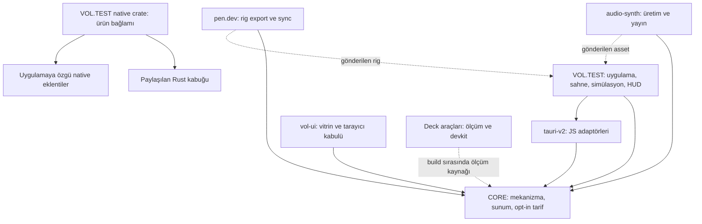

# Monorepo durumu ve iyileştirme kararları

**Başlangıç snapshot'ı:** `feature/core-hardening`, `538e46cf93739872b13a8dc98616c06e4ad5eb7d`

**Yöntem:** kaynak ve kilitli bağımlılıklardan tersine mühendislik, Fallow 3.31.0, yerel kalite kapıları, izole hata ve eşzamanlılık tekrarları.

**Teslim kapsamı:** teknik değerlendirme ve F01–F04 kaynak uygulaması. Başlangıç bulguları aşağıda korunur; güncel uygulama, kapı ve açık cihaz kabulü §18–§19'da ayrılır.

Kullanıcı; mimari, kök düzeni, belge, silme/taşıma/birleştirme ve büyük değişiklik kararlarını bu kapsam içinde açıkça yetkilendirdi. Bu kararlar için tekrar onay beklenmez. İlk teslim rapor ve fazlı TODO idi; kullanıcının devam talebi F01–F04 uygulamasını, commit ve push'u da kapsar. İnsan bekleyen ses kabulünün kaldırılması F01'dir. İş listesi [kök TODO](../TODO.md), ayrıntılı UI görevleri [UI TODO](ui/TODO.md) üzerinden yürür.

## 1. Yönetici değerlendirmesi

VOL.STUDIO'nun en önemli açığı, hata ve eşzamanlılık altında başarı bildiriminin güvenilirliği. Paket sınırları, üretici/tüketici ayrımı, native kabuk sahipliği ve test altyapısı ciddi biçimde düşünülmüş. Buna karşılık **başarı bildiriminin gerçekte neyi kanıtladığı** birkaç kritik sınırda tutarlı değil: başarısız kayıt boşaltması başarılı görünüyor; iki yayıncı aynı hedefi sahiplenebiliyor; yanlış manifest bilgisi doğrulamadan geçiyor; insanın dinlediği sese ait kabul başka PCM'e taşınabiliyor; analiz edilmemiş ELF uyumlu sayılabiliyor.

Bu, daha fazla dosya ve daha fazla kural ekleyerek çözülmesi gereken bir problem değil. Öncelik, mevcut sözleşmeleri hata, geç cevap ve eşzamanlı erişim altında gerçekten korumak olmalı. Test sayısı ve kapsam oranı güçlü; ancak doğruladığımız kusurların çoğu bu oranların kapsamadığı olay sıralarında bulunuyor.

**Bu raporda 20 somut bulgu vardır: 18 P2 ve 2 P3.** P2, ilgili akış kullanılınca düzeltme gerektiren davranış veya güvence kusurudur; P3, daha dar etkili doğruluk kusurudur. Doğrulanmış P0/P1 uzak saldırı veya genel veri kaybı felaketi bulmadım. Bu ifade bir güvenlik sertifikası değildir. Bilinen advisory'ler, henüz ölçülmemiş cihaz kabulleri ve tasarım borçları yeni kusurlardan ayrıca ayrılmıştır.

En güçlü yön: yapılandırılmış mekanizmalar ve yerel sözleşme kapıları. En zayıf yön: dış sistemden gelecek sonucun yaşam süresi ve kanıt zinciri. İkinci bağımsız ürünün henüz bulunmaması nedeniyle CORE'un bütün genişliğinin farklı oyunlarda gerekli olduğu da kanıtlanmış değil.

## 2. Kapsam ve kanıt standardı

Yedi aktif workspace incelendi. Paket manifestleri, importlar, kaynak gövdeleri ve Fallow grafiğiyle başlayan inceleme, Graphify 0.9.75'in yerel AST ve Cargo grafiğiyle genişletildi. Grafik 2.326 dosyadan 10.982 düğüm ve 34.767 kenar çıkardı; semantik belge/LLM geçişi ve clustering çalıştırılmadı. İki barrel dosyasında parser uyarısı, 167 dosyada sıfır sembol var; grafik her importu kusursuz çözmüş kabul edilmedi. Kalıcılık ve metin girişi sorguları tüketicilerle kaynakta karşılaştırıldı. `.pen` dosyası çıkarımı yapılmadı. Alt denetimler CORE, native/platform ve asset üretim hatları olarak ayrıldı; merkezi denetimde bulguların kaynakları ve seçili tekrarları yeniden kontrol edildi.

Bir bulgu için tetikleyici, gerçek davranış, tüketici veya sözleşme etkisi ve test açığı arandı. Fallow uyarıları otomatik olarak hata kabul edilmedi. Katalog API'si, araştırma betiği, native tarafından çağrılan üye ve derlemede üretilen dosya aynı kategoriye konmadı. Aynı şekilde kaynakta bir `spawnSync` veya `fetch` bulunması, saldırgan denetimindeki girdi kanıtlanmadan güvenlik açığı sayılmadı.

Deck SSH, devkit erişimi ve Android tablette yüklü ürünün bulunması salt okuma ile doğrulandı. Fiziksel Steam olayları, oyun performansı, uyku/uyanış, Windows native pencere kabulü, Linux WebView kabulü, insan dinlemesi ve görsel beğeni yapılmadı. Playwright sonuçları gerçek Steam SDK veya cihaz davranışının yerine geçirilmedi. Başlangıç denetiminde `.pen` dosyaları açılmadı; Pencil hattında yalnız düzenleyici betik ve sentetik export manifesti sınandı. F03'te bir Markdown aramasında dosya filtresi unutulduğu için .pen eşleşmeleri araç çıktısına geldi; bu Pencil MCP kuralını ihlal etti. Kaynak değişmedi, çıktı hiçbir belgeye taşınmadı ve kanıt sayılmadı. Her kaynak dosyası elle satır satır incelendiği iddia edilmiyor: otomatik tarama geniş, manuel inceleme risk taşıyan yürütme yollarında derindir.

## 3. Kaynaktan çıkarılan mimari

### Paket yönleri

Kesik oklar runtime importu değildir; üretim/ölçüm ilişkisini gösterir. Oyunun manifestinde çalışma zamanı workspace bağımlılıkları CORE ve tauri-v2; Phaser dış bağımlılıktır. CORE'un çalışma zamanı dış bağımlılığı i18next'tir. Audio ve Pencil araçları oyun çalışma zamanı bağımlılığı değildir. Deck'in CORE ilişkisi `frameSummary.ts` kaynağının derleme sırasında okunup tarayıcı betiğine dönüştürülmesini de içerir.

**Oyun akışı:** uygulama servisleri platform, kayıt ve giriş ömrünü kurar; WorldScene sahne bağlantısını taşır; Phaser dışındaki Simulation oynanış state'ini ilerletir; view/HUD sunar. Sabit adım girdisinin tek basış ile tutulan düğmeyi ayırması ve SimulationClock'un ham/kabul edilen delta ile atılan süreyi ayırması doğru mekanizmalardır. Bu ayrım, native servis ve DOM UI karmaşıklığının simülasyonu bütünüyle ele geçirmesini önlüyor.

**Kalıcılık akışı:** Observable state → son-değer yazma koordinasyonu → platform depolama adaptörü → native atomik store. Native taraf uygulama veri dizinindeki dar dosya adını kullanır; tmp, fsync, backup ve rename yolu vardır. JS bariyerleri ise native shutdown/suspend ACK'inin ön koşuludur. B01 bu son bağlantının hata bilgisini kaybettiğini gösteriyor.

**Native akış:** ürün crate'i kendi `generate_context!()` bağlamını üretir; ortak crate uygulama değil kütüphanedir. Eklenti kaydı, izin ve JS tüketimi yerel kapıda bağlanır. Steamworks stub ve gerçek feature dalı ayrıdır. Shutdown requestId/reason eşleştirmesi eski ACK'in yeni turu bitirmesini önler. Bunlar mimari olarak doğru; callback sahipliği ve ölçüm alanlarının korunması ayrıca kusurludur.

**Audio akışı:** job → brief/program → render → analiz → seçim → bağımsız nihai render → staging encode → kodek sonrası QA → manifest → asset/manifest yerleşimi. PCM ile kodlanmış dosya kimliği ayrı tutulur; doğrulama bağımsız render yapar. B04–B06, zincirin ortak hedef sahipliği, metadata ve insan kabulü katmanlarındaki boşlukları gösterir.

### Depo ölçeği

Git envanterinde **2.860 izlenen dosya** var. Aşağıdaki kaynak sayımı TS/JS/MJS/CJS/TSX/JSX/Rust/CSS/Kotlin dosyalarını içerir; üretilmiş native ağaçları dışlar. Satırlar ham fiziksel satırlardır; çalıştırılabilir kapsam satırı değildir. Paket konfigürasyonları ve betikler kaynak grubuna dahildir.

| Alan         | İzlenen dosya | Kaynak/yapılandırma dosyası | Ham kaynak satırı | Test dosyası | Ham test satırı |
| ------------ | ------------: | --------------------------: | ----------------: | -----------: | --------------: |
| CORE         |           602 |                         287 |            46.120 |          163 |          35.836 |
| tauri-v2     |           171 |                          68 |             7.975 |           17 |           2.496 |
| audio-synth  |         1.400 |                         290 |            55.658 |          144 |          26.097 |
| Deck         |            29 |                           8 |             1.812 |            4 |             904 |
| pen.dev      |            87 |                           5 |               501 |            1 |             266 |
| vol-ui       |            81 |                          29 |             8.013 |           21 |           2.386 |
| VOL.TEST     |           338 |                         104 |             8.511 |           74 |           6.582 |
| Kök betikler |           117 |                          63 |             6.090 |           50 |           4.349 |

Kaynak/yapılandırma toplamı 854 dosya ve 134.680 ham satır; test toplamı 474 dosya ve 78.916 ham satır. Bu yüksek test yatırımı olumlu. Audio-synth'in 1.400 dosyası salt kod büyüklüğü değildir; derlem, referans ve üretim girdileri de sayıya dahildir.

## 4. Doğrulanmış bulgular

| Kimlik | Öncelik | Alan                | Kusur                                                               |
| ------ | ------- | ------------------- | ------------------------------------------------------------------- |
| B01    | P2      | Kalıcılık           | Devam eden yazım reddedilse de flush başarı döndürüyor              |
| B02    | P2      | Uygulama ömrü       | Kapatılan servisin geç yüklemesi autosave'i yeniden kuruyor         |
| B03    | P2      | UI ömrü             | Yok edilmiş metin alanına geç cevap commit yapıyor                  |
| B04    | P2      | Yayın               | Ayrı job'lar aynı hedefi sessizce eziyor                            |
| B05    | P2      | Manifest            | Yanlış PCM biçim/boyut bilgisi doğrulamadan geçiyor                 |
| B06    | P2      | İnsan kabulü        | Dinleme kabulü PCM kimliğine bağlanmamış                            |
| B07    | P2      | Steamworks          | Callback handle hemen düşüyor ve kaydı kaldırıyor                   |
| B08    | P2      | Linux paketleme     | readelf hatası uyumluluk başarısı gibi ele alınıyor                 |
| B09    | P2      | Deck kanıtı         | Sanitizer kapanış sonuçlarını birbirinden ayıramaz hâle getiriyor   |
| B10    | P3      | Deck ortamı         | SLR runtime gözlemi düşüyor, yanlış host etiketi üretiliyor         |
| B11    | P2      | Pencil export       | Tekrarlanan kaynak node yarım çıktı ve staging kaybı bırakıyor      |
| B12    | P2      | Ortam teşhisi       | Doctor'ın linker başarısızlığı iddiası çalışan derlemeyle çelişiyor |
| B13    | P2      | Windows test kapısı | Audio disk-hatası fixture'ları üç testi platforma aykırı düşürüyor  |
| B14    | P2      | Süreç testleri      | POSIX tsx shim'i Windows'ta süreç başlatamıyor; 13 test düşüyor     |
| B15    | P2      | Yol testleri        | URL pathname ve separator varsayımları sekiz testi düşürüyor        |
| B16    | P2      | Windows süreçleri   | Genel shell kullanımı yol ve argv sınırlarını bozuyor               |
| B17    | P2      | Mermi fiziği        | İki noktalı isabet testi tank köşesini geçen mermiyi kaçırıyor      |
| B18    | P2      | Araç fiziği         | Araç temas düzeltmesi dünya sınırını yeniden bozuyor                |
| B19    | P3      | Saf simülasyon      | Kök CORE importu headless senaryoya UI/CSS bağı taşıyor             |
| B20    | P2      | Audio kaynak ömrü   | Eski iş kayıtları silinmiş yayını yeniden publish yönüne götürüyor  |

### B01 — Flush bariyeri başarısız yazımı başarıya dönüştürüyor

**Kaynak:** [PersistedObservableState.ts:96](../core/src/persistence/PersistedObservableState.ts), terminal yol [113](../core/src/persistence/PersistedObservableState.ts).

`set(1)` ile başlayan kayıt henüz bitmemişken flush çağrılır ve store.save reddedilir. Setter hatayı alır; flush yalnız hata taşımayan `writer.whenIdle()` sonucunu beklediğinden başarıyla çözülür. `pendingPersist` sadece debounce beklerken tutuluyor; başlamış yazımın sonucunu temsil etmiyor.

Merkezi tekrarda çıktı: `setter:"audit-disk-failure", flush:"resolved"`. VOL.TEST GameSettings varsayılan sıfır debounce ile bu sınıfı tüketir. [GameServices.ts:186](../games/vol-test/src/app/GameServices.ts) flush retlerini toplar; kaybolan ret kapanış/uyku bariyerine ulaşmaz. Böylece son ayar kaydedilmemişken dayanıklılık onayı verilebilir.

**Düzeltme ölçütü:** son state'in yazım sonucunu devam eden/debounce bekleyen ayrımından bağımsız takip etmek; son değer dayanıklı depoya ulaşmadıysa bariyeri reddetmek veya başarılı yeniden yazımı beklemek. Regresyon hem flush hem flushAndDispose sırasında başlayan yazımın reddini içermeli. Geçmiş bir hatanın sonradan başarılı son-değer yazımıyla telafi edilmesi ayrıca ayrılmalı. Disk gerçekten bozulmuş gibi bir cihaz turu yapılmadı; hata adaptör sözleşmesinden enjekte edildi.

### B02 — Dispose sonrası yükleme kaynakları yeniden doğuruyor

**Kaynak:** [GameProgress.ts:19](../games/vol-test/src/app/GameProgress.ts), [dispose:43](../games/vol-test/src/app/GameProgress.ts).

load depoyu beklerken dispose çağrıldığında await sonrası devam, yeni AutosaveCoordinator kuruyor. Tekrar `activeIntervalsAfterDisposed:1` verdi. Coordinator interval ve tarayıcı listener'larının sahibi kapanmış nesne oluyor.

Gerçek hata sırası [GameServices.ts:116](../games/vol-test/src/app/GameServices.ts) Promise.all içindeki settings yüklemesinin erken reddi, catch temizliği ve progress yüklemesinin geç tamamlanmasıdır. Promise.all kalan yüklemeyi iptal etmez. Native bridge üzerinde bu sıra cihazla oluşturulmadı; GameProgress kaynak davranışı gerçek coordinator ile yürütüldü.

**Düzeltme ölçütü:** terminal bayrak veya generation kontrolü await sonrasında kaynak kurulumunu durdurmalı. Tekrar load destekleniyorsa eski coordinator'ın sahipliği de korunmalı. Normal yükleme testleri yeterli değil; dispose-during-load ve GameServices erken-ret/geç-başarı regresyonları gerekli.

### B03 — Yok edilmiş metin alanı geç native cevapla commit yapıyor

**Kaynak:** [textEntry.ts:131](../core/src/ui/textEntry/textEntry.ts), [Input.ts:60](../core/src/ui/primitives/Input.ts), [destroy:101](../core/src/ui/primitives/Input.ts).

TextEntryProvider açıldıktan sonra Input destroy edilir; provider daha sonra canceled:false döner. Promise devamı koşulsuz apply çağırır; DOM kopmuşken onCommit çalışır. Merkezi jsdom/gerçek Input tekrarında `connected:false, commits:["2"]` görüldü. TextArea aynı yardımcı yolu kullanıyor.

[ScenarioPanel.ts:32](../games/vol-test/src/hud/ScenarioPanel.ts) seed alanının commit'i ayarı değiştirir. Bu nedenle etki yalnız bağlantısız DOM'a yazmak değildir; eski cevap dış state'i değiştirebilir.

**Düzeltme ölçütü:** klavye isteğinin iptal/generation bilgisi component ömrüne bağlı olmalı; apply ve refocus yalnız aktif sahibin isteği için çalışmalı. Yalnız isConnected kontrolü bağlı ama kapanmış yüzeyleri kapsamaz. Input ve TextArea için destroy-before-response ve eski isteğin yeni isteği ezmesi sınanmalı.

### B04 — İki yayıncı aynı hedefte ikişer başarı alıyor

**Kaynak:** [publish.ts:219](../devtools/audio-synth/src/protocol/publish.ts), sahiplik denetimi [300](../devtools/audio-synth/src/protocol/publish.ts), yerleşim [437](../devtools/audio-synth/src/protocol/publish.ts).

Job kilidi job dizininde; hedef asset ortak kilitle korunmuyor. Ayrı job'lar boş hedefi aynı anda uygun görüp render/encode sonrasında aynı hedefe yerleşebiliyor. İki ayrı Node süreç ve gerçek geçici repo ile tekrarda ikisi de `ok:true`, exit 0 döndü; final manifest yalnız audit-b'ye aitti. Önceki tekrarda audit-a kazandı. Gerçek asset değiştirilmedi.

Bu, yayın sahipliğini sessizce başka işe aktarır; kaybeden job'un başarı kaydı hedefle tutarsız kalır. Asset ile manifestin farklı kazananlara ait olabileceği daha dar interleaving bu deneyde ayrıca oluşturulmadı ve gerçekleşmiş gibi raporlanmıyor.

**Düzeltme ölçütü:** ortak hedef kilidi; overwrite kontrolü aynı kilit altında commit öncesi yeniden yapılmalı. Kilit edinme sırası belirli olmalı. İki farklı job, ortak hedef ve yalnız tek başarılı sahiplenme şartı gerçek süreç regresyonuyla korunmalı.

### B05 — Manifest, imkânsız PCM bilgisiyle identical sayılıyor

**Kaynak:** [manifest.ts:168](../devtools/audio-synth/src/protocol/manifest.ts), [verifyManifest:556](../devtools/audio-synth/src/protocol/publish.ts).

Geçerli bir fixture manifestinde `asset.bytes=1`, `sampleRate=123`, `channels=99`, `frames=-1` ve `format="invalid-format"` yapıldı. Hem validateManifest kabul etti hem verifyManifest `ok:true/change:identical` döndürdü; gerçek dosya 5.388 byte idi.

PCM hash karşılaştırması iyi, ancak PCM nesnesinin tüm skaler alanları ve disk byte sayısı doğrulanmıyor. Bu alanlar teslim/provenance sözleşmesinin parçası; frames regresyon kodunda da tüketiliyor.

**Düzeltme ölçütü:** her zorunlu alanın tip, enum, aralık ve varlık doğrulaması; bağımsız render sonucunun rate/channel/frame bilgileri ve disk dosyasının byte boyutuyla karşılaştırma. Yanlış tip, eksik alan ve makul fakat gerçek renderdan farklı değerler ayrı test edilmeli. Bu metadata açıklarının uzaktan kod yürütme yarattığı gösterilmedi.

### B06 — İnsan kabulü dinlenen PCM'e bağlı değil

**Kaynak:** [canary.ts:213](../devtools/audio-synth/src/protocol/canary.ts), [listening.ts:262](../devtools/audio-synth/src/protocol/listening.ts).

Review kaydı status/version/note taşıyor; güncel PCM hash'ini taşımıyor. Bayatlık yalnız görev sürümüne bağlı. Bubble programı bellekte radius 3 → 3.2 değişimiyle farklı PCM üretti; mekanik QA iki sesteki beklentileri geçti; görev sürümü aynıydı. Mevcut kabul hâlâ `heard-acceptable`; hash bağı yok.

[DESIGN.md:127](../devtools/audio-synth/DESIGN.md) kabulü görev sürümü ve PCM kimliğiyle bağlı anlatıyor. Kod bu iddianın yalnız ilk yarısını uyguluyor. Yeni ses için insan kabulü bu denetimde verilmedi.

**Karar ve kapanış:** kullanıcı, zorunlu insan kabulü ve human-pending mantığını kaldırmayı seçti. Review'a yeni hash alanı eklemek yerine durum, CLI/API, review dosyası, sunucu yazma yolu ve bağımlı testler F01'de kaldırılacak. Mekanik QA, render seçimi, PCM/manifest kimliği ve kodek sonrası doğrulama korunacak. Farklı PCM için eski insan kabulünü yeniden kullanma yolu kalmayacak; mekanik başarı sesin beğenildiği anlamına gelecek biçimde yeniden adlandırılmayacak.

### B07 — Steam callback'ı kayıt ifadesinin sonunda kaldırılıyor

**Kaynak:** [service.rs:273](../tauri-v2/plugins/vol-steamworks/src/service.rs).

register_callback dönüşündeki CallbackHandle tutulmuyor. Cargo.lock'un sabitlediği Steamworks 0.13.1'de Drop, callback kaydını map'ten kaldırır. Kaynak yorumu bunun tersini varsayıyor. Kilitli dependency'nin Drop gövdesini kullanan küçük Rust harness'inde kayıt sayısı sırasıyla `discarded=0, retained=1, after_drop=0` çıktı.

Steamworks feature açık ve Steam başlatması başarılı olduğunda overlay olayı yayınlanamaz; [GameServices.ts:151](../games/vol-test/src/app/GameServices.ts) overlay duraklatma tüketicisine ulaşmaz. Default stub dalını derlemek bu kusuru sınamaz. Oyun başka odak kaybı mekanizmasıyla duraklayabilir; bu, callback ömrünü düzeltmez.

Aynı kilitli bağımlılığın metin/kayan klavye yardımcıları da callback handle'ını düşürüyor. VOL metin köprüsü bu yardımcıları tüketir; gerçek Steam metin sonucu gelmediğinde JS sağlayıcı 10 dakikalık üst sınıra kadar bekleyebilir. Bu ikinci etki dependency kökenlidir; yalnız overlay handle'ını tutmak yeterli değildir.

**Düzeltme ölçütü:** callback handle servis/bağlantı state'inde sahiplenilmeli; reconnect/drop sırası korunmalı. Klavye yardımcıları ayrıca güvenilir sahiplikle düzeltilmeli. Native yaşam süresi testi ve gerçek Steam overlay/metin turu gerekli; fiziksel tur yapılmadı.

### B08 — GLIBC bekçisi okuyamadığı ELF'i uyumlu sayıyor

**Kaynak:** [glibc-cap.mjs:81](../scripts/linux/glibc-cap.mjs), başarı mesajı [build-steamrt4.mjs:224](../scripts/linux/build-steamrt4.mjs).

readelf yoksa, dosya okunamıyorsa veya komut başarısızsa catch yalnız continue yapıyor. Dosya toplamda kalıyor; ihlal listesi boş olabiliyor. ELF sihirli baytlı geçici dosya ve ENOENT atan reader ile gerçek fonksiyon `{files:1,offenders:[]}` döndürdü. Paketleyici bu şekli bütün ELF'ler tavan altında diye raporluyor.

Statik ELF'te sürüm bölümü olmayabilir; başarılı boş analiz ile başarısız analiz aynı durum değildir.

**Düzeltme ölçütü:** komut hatası fatal veya açık unverified sonucu olmalı. Bütün dosyalar analiz edilmeden uyumluluk onayı çıkmamalı. Eksik readelf, analiz hatası ve başarıyla okunmuş sürümsüz ELF ayrı regresyonlarla korunmalı. Windows üzerinde gerçek Linux AppDir uyumluluğu ölçülmedi.

### B09 — Gizlilik filtresi kapanış kanıtını da siliyor

**Kaynak:** [deck-contract.mjs:551](../devtools/deck/scripts/deck-contract.mjs).

sanitizeReport requestId ve outcome alanlarını düşürüyor; dolu reason metnini hasError:true'ya indiriyor. Gerçek fonksiyonla success/failed/timedOut girdilerinin üçü de aynı `{v:1,src:"rust",type:"exit-after-grace",hasError:true}` kaydına dönüştü; merkezi tekrarda tekrar doğrulandı.

Ham özel kayıtta veri bulunabilir; fakat paylaşılabilir kanıtta başarı, kayıt hatası ve süre aşımı ayırt edilemiyor. Başarılı kapanış bile hata işaretli görünüyor. Gizlilik yaklaşımı doğru, sınıflandırma kaybı yanlış.

**Düzeltme ölçütü:** doğrulanmış requestId ve dar reason/outcome enumları korunmalı; serbest hata metni ayrı filtrelenmeli. Native üretim → sanitizer → paylaşılabilir rapor roundtrip testi, hem sonuç ayrımını hem kişisel alan silinmesini sınamalı.

### B10 — SLR ölçümü yanlışlıkla host diye etiketleniyor

**Kaynak:** [vol-diagnostics/lib.rs:57](../tauri-v2/plugins/vol-diagnostics/src/lib.rs), [probe.js:180](../devtools/deck/web/probe.js), [deck-contract.mjs:671](../devtools/deck/scripts/deck-contract.mjs).

Native environment allowlist PRESSURE_VESSEL_RUNTIME'ı taşımıyor. Probe ve özetleyici eksik runtime'ı host diye gösteriyor. İzin listesinden çıkarılan native filtre ve gerçek sanitizer/summarizer zinciri, sentetik steamrt4 ortamında `summaryRuntime:"host"` verdi.

**Düzeltme ölçütü:** ham path yerine yalnız güvenli steamrt sürüm parçası native tarafta korunmalı. Eksik gözlem unknown olmalı; yokluk kesin host kabulüne çevrilmemeli. Mevcut özet testinin alanı elle vermesi yeterli değil; native-to-summary alan sözleşmesi sınanmalı.

### B11 — Pencil export hatası kaynağı tüketip yarım hedef bırakıyor

**Kaynak:** [organize-pen-export.mjs:66](../devtools/pen.dev/scripts/organize-pen-export.mjs), [executeMoves:156](../devtools/pen.dev/scripts/organize-pen-export.mjs).

Farklı partId'ler aynı nodeId'yi kullanabilir; önkontrol yalnız partId tekrarını yakalar. İlk kopyadan sonra kaynak silinir; ikinci taşıma ENOENT ile düşer. Sentetik manifest/PNG-adlı fixture tekrarında exit 1; body hedefi var, arm yok, metadata yok, staging kaynağı yoktu.

İkinci kaynak kullanımı yazım öncesinde reddedilmeliydi veya bütün hedeflere kopyalama bitince kaynak temizlenmeliydi. Manuel Pencil export'undan gelen ara çıktının kaybı bir insan adımını tekrarlatabilir. Fixture gerçek .pen dosyasına erişmedi.

**Düzeltme ölçütü:** parts/previews kaynak yolları tek plan olarak önkontrolden geçmeli; duplicate source kararı yazım öncesi verilmelidir. CLI seviyesinde kopyalama hatası, duplicate source ve rollback regresyonları gerekli. Mevcut rigExport testi bu düzenleyici CLI'yi bütünüyle sınamıyor.

### B12 — Doctor, PATH gözleminden yanlış derlenemezlik sonucu çıkarıyor

**Kaynak:** [doctor.mjs:60](../scripts/doctor.mjs), [79](../scripts/doctor.mjs).

Bu oturumda doctor, PATH'teki ilk link.exe GNU olduğu için “her hedef bağlanamaz” diyerek exit 1 verdi. Aynı oturumda stdin'den `fn main() {}` ile yeni Rust executable derlenip link edildi; rustc exit 0 döndü. Değiştirilmiş PATH veya eski executable kullanılmadı. Mevcut toolchain'de yalnız where.exe ilk sonucu, rustc'nin fiilen seçtiği linker'ı kanıtlamıyor.

**Düzeltme ölçütü:** PATH gölgesini uyarı olarak tutmak ve etkin toolchain/config üzerinden küçük gerçek link probu yapmak; hard failure'ı bu probun sonucuna bağlamak. GNU-first, MSVC discovery ve açık linker override senaryoları sınanmalı. Bu sonuç Build Tools'un gereksiz olduğu anlamına gelmez; bu makinedeki doctor teşhisinin aşırı kesin olduğunu gösterir.

### B13 — Audio disk-hatası testleri Windows sözleşmesiyle uyuşmuyor

**Kaynak:** [commitFiles.test.ts:66](../devtools/audio-synth/tests/protocol/commitFiles.test.ts), [97](../devtools/audio-synth/tests/protocol/commitFiles.test.ts), [131](../devtools/audio-synth/tests/protocol/commitFiles.test.ts); karşı davranış [fs.ts:117](../devtools/audio-synth/src/protocol/fs.ts).

Hedefli gerçek Windows koşusunda 8 testten 3'ü düştü, 5'i geçti. İki rollback fixture'ı chmod(0555) ile dizine yazmayı engelleyeceğini varsayıyor; Windows'ta bu POSIX semantiği oluşmadığından beklenen hata üretilmiyor. Üçüncü test olmayan dizinde fsyncDir'ın ENOENT atmasını bekliyor; üretim kodu Windows'ta bu işlemi açıkça no-op yapıyor.

Bu sonuç commitFiles rollback'inin Windows'ta bozuk olduğunu kanıtlamaz; testin hata üretme mekanizması ve platform beklentisi yanlış. Buna karşılık signoff'un Windows'ta mevcut fixture'larla yeşil olması beklenemez.

**Düzeltme ölçütü:** rollback için izin bitine bağlı olmayan gerçek dosya sistemi hata düzeni veya dar IO hata enjeksiyonu; fsync sözleşmesini platforma göre açık sınamak. Üç testi sebepsiz skip etmek yerine Windows no-op ve POSIX hata yolu ayrı korunmalı. Kayıt: commitFiles-targeted.log, komut `pnpm --filter @volstudio/audio-synth exec vitest run tests/protocol/commitFiles.test.ts`, exit 1.

### B14 — Süreçler arası kabul testleri Windows'ta süreci başlatamıyor

**Kaynak:** [cli.test.ts:19](../devtools/audio-synth/tests/protocol/cli.test.ts), [spawnSync:37](../devtools/audio-synth/tests/protocol/cli.test.ts); aynı yöntem soundCli, search, auditionServer, crossProcess ve qaParity testlerinde de var.

Testler `node_modules/.bin/tsx` dosyasını doğrudan spawnSync ile yürütüyor. Windows'ta bu uzantısız POSIX shim'i yürütülebilir süreç değil. Merkezi bağımsız probda `status:null,error.code:"ENOENT"`; aynı kurulu tsx girişini Node executable üzerinden çağırınca exit 0 ve sürüm çıktısı alındı. Bu altı dosyada hedefli koşunun **13 hatası** bu süreç başlatma yolunda oluştu. Bazı helper'lar res.error kontrolü yapmadan stderr.trim veya JSON.parse çağırdığı için asıl ENOENT, trim/JSON hatası olarak gizleniyor; bir sonraki test adımı hiç üretilmeyen dosyayı arıyor.

Bu testler taze süreçte provenance ve deterministik arama gibi önemli sözleşmeleri korumayı amaçlıyor; Windows'ta hedef programa ulaşamıyorlar. Üretim CLI'nin Windows'ta çalışmadığı bu bulgudan çıkarılamaz.

**Düzeltme ölçütü:** ortak test süreç yardımcısı process.execPath ve çözülmüş JS girişini kullanmalı; başlatma hatasını stdout parse edilmeden raporlamalı. Platform testleri ilk hedef komutun gerçekten başladığını ve süreçler arası anlamlı çıktıyı karşılaştırmalı. Shell açarak metin birleştirmek gerekli değil.

### B15 — Test kök yolları URL ve işletim sistemi yolunu karıştırıyor

**Kaynak:** [parallel.test.ts:21](../devtools/audio-synth/tests/protocol/parallel.test.ts), [chip.test.ts:8](../devtools/audio-synth/tests/program/chip.test.ts), [incremental.test.ts:13](../devtools/audio-synth/tests/program/incremental.test.ts), [sourceClosure.test.ts:7](../devtools/audio-synth/tests/protocol/sourceClosure.test.ts), [separator beklentisi:39](../devtools/audio-synth/tests/protocol/sourceClosure.test.ts).

REPO değişkeni `new URL(..., import.meta.url).pathname` ile kuruluyor. Windows dosya URL'sinin pathname'i `/C:/Dev/...`; gerçek dosya yolu değil. Merkezi prob fileURLToPath ile doğru `C:\\Dev\\...` dönüşümünü gösterdi. Hedefli takımda yanlış kök, `C:\\C:` ENOENT veya “workspace-lifecycle.json yok” hatasına dönüşüyor. Chip'te üç, parallel'de iki, incremental'da bir ve sourceClosure'da bir test bundan düşüyor. SourceClosure'ın bir başka testi de node:path.relative sonucunu normalize etmeden POSIX slash dizisiyle karşılaştırıyor. Toplam **sekiz hata** bu iki yol varsayımında.

Bunlar PCM doğruluğunun bozulduğu kanıtı değildir; ilgili testlerin gerçek depo girdisine ulaşmasını engeller. Hatalı test köküne tolerans ekleyerek üretim path güvenliğini gevşetmek yanlış çözüm olur.

**Düzeltme ölçütü:** dosya URL'leri fileURLToPath ile çevrilmeli; metinsel karşılaştırmanın platformlar arası sözleşmesi varsa separator test sınırında normalize edilmeli. Windows ve POSIX kök/yol örnekleriyle doğru fixture'a ulaşıldığı sınanmalı.

### B16 — Windows süreç yardımcısı argv sınırını shell'e bırakıyor

**Önem:** P2. **Kanıt:** [runCommand.mjs:16](../scripts/quality/tests/runCommand.mjs), [rust.mjs:75](../scripts/quality/rust.mjs), [device-benchmark.mjs:20](../scripts/android/device-benchmark.mjs).

Windows için genel `shell: true` kullanımı, argüman dizisinin sınırlarını korumuyor. Bağımsız probda tek `hello world` argümanı ikiye ayrıldı; boşluklu dizindeki .CMD hedefi exit 1 verdi; `safe&echo SHELL_BOUNDARY_CROSSED` argümanı ikinci shell komutu çalıştırdı. Bunlar kontrollü yerel girdilerdi; uzak saldırganın bu girdilere erişimi gösterilmedi. Caller PATH'in bütünüyle yok sayıldığı yorumunu da prob doğrulamadı.

**Karar ve kapanış:** gerçek exe için native argv; cmd/bat için dar ve açık quoting adaptörü; TS helper için Node + JS giriş. Boşluk, Unicode, tırnak, `&`, farklı cwd ve özelleştirilmiş PATH regresyonları birlikte korunur. Her subprocess'ı shell'e geçirmek çözüm değil. Deck SSH yardımcısı zaten shell kapalıdır; doğru argv ve uzak shell quoting parçaları korunur. F02.

### B17 — Mermi taraması döndürülmüş gövdeyi kaçırıyor

**Önem:** P2. **Kanıt:** [Projectiles.ts:311](../games/vol-test/src/sim/combat/Projectiles.ts), gerçek Tank/World/Projectiles tekrarı.

Yarı boyları 26/21 olan gövde ve 45° dönüşte, gerçek 900 hız/60 Hz koşulunda mermi x=1000'den yaklaşık 1014,960'a ilerledi. Segment üzerindeki x≈1003,535 noktası gövdenin içinde; mevcut orta ve son nokta örnekleri dışında. Sonuç: olay yok, mermi hâlâ canlı. İki örnek sürekli çarpışma taramasının yerine geçmiyor. Önizlemenin aynı örneklemeyi kullanması, önizleme/runtime paritesini kusurdan korumuyor.

**Karar ve kapanış:** segmenti gövdenin yerel uzayına dönüştürüp dikdörtgenle gerçek kesişim hesabı; en erken temas, sahip dışlaması ve çoklu hedef deterministik sıralaması. Köşe/graze, yüksek hız, aynı adımda birden fazla aday ve önizleme/runtime sözleşmesi regresyonla sınanır. F06.

### B18 — Araç teması duvar çözümünü geri bozuyor

**Önem:** P2. **Kanıt:** [Simulation.ts](../games/vol-test/src/sim/Simulation.ts), çoklu araç değişmez testleri.

Simulation önce dünya sınırını çözüyor, sonra araç–araç SAT düzeltmesi konumu yeniden itiyor. Gerçek modelde x=26,y=500 oyuncu, x=500,y=500 ikinci araç ve hareket/boost ile 106. adımda sol gövde köşesi yaklaşık −2,276'ya çıktı. Çoklu araç testinin yalnız merkez kontrolü bu kusuru yakalamıyor; tek araçta köşeleri kontrol etmek çoklu temas güvence boşluğunu kapatmıyor.

**Karar ve kapanış:** duvar ve araç temasını aynı son konum sözleşmesiyle, sınırlı/deterministik iterasyonla çöz; adımın sonunda bütün araç köşeleri dünya içinde kalır. Duvar dibinde iki/üç araç, karşı kuvvet, köşe ve uzun oturum regresyonları eklenir; yalnız bu tekrarın merkezini clamp etmek yeterli değil. F06.

### B19 — Başsız senaryo çalıştırıcısı DOM UI yüzeyine bağlanıyor

**Önem:** P3. **Kanıt:** [ScenarioRunner.ts:1](../games/vol-test/src/sim/scenarios/ScenarioRunner.ts), CORE export haritası.

Senaryo çalıştırıcısı saf simülasyon ihtiyacını kök CORE barrel'ından alıyor. Bu import UI ve `theme.css` yüklemesine kadar uzanıyor; Node başsız importu bilinmeyen .css uzantısında düşüyor. Vite test ortamı bu bağı görünmez kılıyor. Bu, Phaser sınır kapısının ihlali olarak raporlanmıyor; transitive sunum yükü ayrı bağımlılık sorunu.

**Karar ve kapanış:** mevcut `@volstudio/core/random` ve `@volstudio/core/spatial` gibi public alt yüzeyler üzerinden saf simülasyon importlarını daralt. Node'da DOM/CSS loader olmadan sabit tohumlu senaryo çalışır; public tip/API kilidi ve oyun build'i korunur. Toplu barrel silme veya sırf sayıyı azaltan yeniden export yapılmaz. F06.

### B20 — Emekli audio yayınları yeniden yayınlanacak iş gibi kalmış

**Önem:** P2. **Kanıt:** [jobStatus](../devtools/audio-synth/src/protocol/status.ts), [verifyAll.ts:46](../devtools/audio-synth/scripts/lib/verifyAll.ts), gerçek job envanteri.

86 kayıtlı işte 189 render kaydı var; 17 işin publication yolu bulunmuyor. Motor/iz/boost/servo/skid, eski uzak/orta blast ve pause/resume işlerini içeriyor. Gerçek `jobStatus`, engine-idle/ui-pause/blast-a-mid için `publication.state=corrupt` ve `next.action=publish` döndürdü. Aktif manifestlerin doğrulanması eski job envanterini taramadığı için audio-verify yeşil kalabiliyor.

**Karar ve kapanış:** aktif tüketici, manifest, bank/bundle, fixture ve kaynak kökenlerinden erişilebilirlik çıkar; emekli hedefin yeniden publication önerisini kaldır. Gerekçesiz job/render kaydı silinir veya yeniden üretim için gereken kaynakla birleştirilir. 103 eski renderın tamamı yalnız eski olduğu için ölü sayılmaz. Dry-run referans kırığı ve beklenmeyen yayın diff'i sıfır; kalan aktif işlerin status'u doğru. F05.

## 5. Fallow sonuçlarının doğru yorumu

Fallow MCP aracı bu oturumda sunulmadığı için eklentinin tarif ettiği CLI kullanıldı. Çalıştırıcı depoya dependency eklemeden `pnpm dlx fallow@3.31.0` ile sürüme sabitlendi. JSON/quiet/explain/no-cache kullanıldı. Repo dışında tek seferlik config, node:test ve yerel gate girişlerini ekledi; iki üretilen Deck vendor importunu ayırdı. Hook, telemetry veya kalıcı Fallow yapılandırması eklenmedi.

| Ölçü                      | Sıfır config | Girişleri uyarlanmış tarama |
| ------------------------- | -----------: | --------------------------: |
| Aday toplamı              |          415 |                         299 |
| Kullanılmayan dosya adayı |           84 |                          12 |
| Export adayı              |          151 |                         109 |
| Tip adayı                 |           57 |                          57 |
| Class member adayı        |          114 |                         114 |
| Dependency adayı          |            1 |                           1 |
| Çözülemeyen import        |            2 |                           0 |
| Runtime/paket döngüsü     |            0 |                           0 |
| Fallow sağlık skoru       |     73,2 / B |                    75,6 / B |

**299, doğrulanmış hata sayısı değildir.** Kalan 12 dosya arasında quality.json üzerinden çağrılan scaling.ts, açıkça kullanılan fault worker'lar, Pencil betikleri, native embed JS ve native test bulunuyor. CORE katalog API'si de bilinçli bekletilir. Bu rapor otomatik silme önermez.

Fallow mimari boundary/policy detector'ları yapılandırılmadığını açıkça bildiriyor; bu alanlarda sıfır, “ihlal yok” kanıtı değildir. Repo'nun kendi layer/contract kapısı bunun için esas alınmalıdır. Önceki node_modules kalıntısındaki games/vol-ui klasörü package.json taşımadığından workspace discovery uyarısı veriyor; aktif bir sekizinci paket bulunduğu anlamına gelmiyor.

Health 1.277 dosya ve testler dahil 16.844 fonksiyon analiz etti. Son tam çıktıda 374 eşik bulgusu ve 1.125 dosya skoru saklandı; production semantic dupes çıktısı 966 grubun tamamını içerir, grup atlanmadı. 374 fonksiyon bir veya daha fazla eşik üstündedir. Kapsam modeli `static_estimated`; CRAP ve coverage-gap sayıları gerçek V8 kapsam yüzdesi diye sunulamaz. Config validator'ın “none” görünmesine rağmen doğrudan node:test testleri vardır. Bu nedenle “374 testsiz kritik fonksiyon” sonucu yanlıştır.

| İnceleme noktası              | Döngüsel karmaşıklık | Bilişsel karmaşıklık | Pratik anlamı                                            |
| ----------------------------- | -------------------: | -------------------: | -------------------------------------------------------- |
| validateQualityConfig         |                   67 |                  170 | Merkezi kural fonksiyonunun değişiklik incelemesi pahalı |
| validateWorkspaceLifecycle    |                   54 |                   92 | Freeze, path ve workspace doğrulaması çok dal taşıyor    |
| Deck safe/sanitizer yolu      |                   48 |                   54 | Gizlilik ve kanıt doğruluğu aynı yerde yoğunlaşıyor      |
| GamepadPointerController.poll |                   46 |                   56 | Giriş sahipliği/modal/state geçişleri hassas             |
| validateMusicProgram          |                   39 |                   39 | Büyük doğrulama yüzeyi; salt skor için bölünmemeli       |
| WorldScene.create             |                   29 |                   16 | Ürün bağlantısı ve kaynak sahipliği yoğun                |

Varsayılan mild health ölçümünde tekrar oranı %2,0; bağımsız semantic dupes bütün taramada %17,40, production filtresinde %17,31. Bunlar farklı eşleme yöntemleridir; birbirinin yerine kullanılamaz. Semantic eşleme tip tanımlarını, preset verisini ve benzer DOM kuruluşlarını da eşler. 132 satırlık Joystick/SquareJoystick ortaklığı ve 68 satırlık benchmark/canary ortaklığı gözden geçirilebilir; bütün benzer DOM kuruluşlarını tek genel soyutlamaya toplamak için yeterli gerekçe değildir.

Security taraması 20 aday verdi. DisposableScope'taki `request(callback)` requestAnimationFrame enjeksiyonudur, HTTP isteği değildir; SSRF adayı yanlış pozitiftir. Scorer spawnSync shell kullanmaz ve açık kullanıcı yapılandırmasıyla argv çalıştırır. Audition server yanıt başlıkları sabit ve route/origin kontrolleri vardır. Bu örneklerde doğrulanmış injection zinciri bulunmadı. Hardcoded-secret kategorisi ayrıca etkinleştirilmedi; taramayı eksiksiz sır taraması diye sunmuyorum.

## 6. Kalite kapıları ve güvenlik durumu

**Signoff başarısız; high bileşimi geçti.** `pnpm exec just report signoff --json` toplam 2.112.039 ms (35 dakika 12 saniye) sürdü ve exit 1 verdi. Yapılandırılmış kayıtta high'ın 13 aşamasının tamamı başarılı; sonraki coverage-audio aşaması 25 test hatasıyla başarısızdır.

| Kapı/aşama                              | Sonuç                      | Kanıt ve sınır                                             |
| --------------------------------------- | -------------------------- | ---------------------------------------------------------- |
| contract, format-check, typecheck, lint | Geçti                      | quick bileşimi; kaynak ve repo sözleşmeleri                |
| rust, lint-css                          | Geçti                      | Yerel hedef derlemesi; gerçek Steam cihaz kabulü değil     |
| coverage, coverage-shape                | Geçti                      | Audio dışındaki aktif kapsam paketleri                     |
| audio-test                              | Geçti                      | high'ın seçili audio testi; bütün audio takımı değil       |
| build, bundle, scaling                  | Geçti                      | Aktif paketlerin tanımlı yerel bütçeleri                   |
| e2e                                     | Geçti                      | Tanımlı Chromium/WebKit projeleri; bölüm 7'de kapsam farkı |
| coverage-audio                          | Başarısız                  | 25 test; aşama 1.671.655 ms (27 dakika 52 saniye)          |
| audio-verify                            | Ayrı koşuda geçti          | Signoff bu aşamaya ulaşmadı; bağımsız exit 0 kaydı var     |
| security-js                             | Ayrı koşuda başarısız      | braces high advisory; exit 1                               |
| security-rust                           | Ayrı koşuda geçti, uyarılı | exit 0; 9 izin verilen uyarı                               |
| doctor:env                              | Başarısız                  | Linker teşhisi gerçek başarılı derlemeyle çelişiyor; B12   |

Coverage-audio başarısız olduğundan güncel audio LCOV/kapsam yüzdesi oluşmadı ve o tarifin sonraki coverage-shape-audio komutu çalışmadı. Önceki audio yüzdesi bu koşunun kanıtı sayılmadı. Yapılandırılmış kapı çıktısı ham assertion ayrıntılarını saklamadığından, başarısız 12 dosya ayrıca kapsamsız ve JSON reporter ile tekrar çalıştırıldı: **92 testin 68'i geçti, 24'ü düştü**. Bu 24 hata B13–B15'teki üç kök neden grubunda yeniden üretildi. İlk tam koşuda başarısız görünen sfx.test.ts hedefli tekrarda geçti; bu bir hatanın nedeni eldeki kayıttan kesinleşmedi. Kapsam/zamanlama etkisi olasılık olarak kalıyor, doğrulanmış neden diye yazılmıyor.

Dolayısıyla “high yeşil” doğrudur; “signoff yeşil”, “bütün audio testleri geçti” ve “sürüm kapısı tamamlandı” doğru değildir.

### Gerçek kapsam

Aşağıdaki değerler bu koşunun tamamlanmış coverage kaydıyla eşleşen LCOV pay/paydasından hesaplandı. Çalıştırılabilir satır, fonksiyon ve dal yüzdesidir; ham fiziksel satır değildir. Statement metriği LCOV'dan yeniden üretilmedi.

| Paket       |  Satır | Fonksiyon |    Dal |
| ----------- | -----: | --------: | -----: |
| CORE        | %95,28 |    %93,95 | %85,77 |
| pen.dev     |   %100 |      %100 |   %100 |
| tauri-v2 JS | %99,11 |      %100 | %92,88 |
| VOL.TEST    | %99,39 |    %97,91 | %93,88 |
| vol-ui      | %94,63 |    %83,99 | %60,17 |

tauri-v2 yüzdesi Rust/Kotlin kapsamı değildir; pen.dev yüzdesi düzenleyici .mjs CLI'nin bütün hata yollarını kanıtlamaz. Denominatörler Vitest src/**/*.ts kapsamıdır. Deck kapsamı gerekçeli muafiyet taşıyor; contract/probe testleri ayrı güvence sağlar.

### Advisory ve bağımlılık sınırları

`security-js` exit 1 verdi: `braces@3.0.3`, `GHSA-vfj7-8cjw-p6xm`, high. `pnpm why braces` zinciri stylelint/micromatch/fast-glob/globby geliştirme yolunu gösteriyor. Gönderilen oyunda bu hatanın ulaşılabilir olduğu gösterilmedi. Bu risk mevcut TODO'da zaten açık.

Audit çıktısı patched >=3.0.4 yazdı, ancak pnpm paket kayıt sorgusu (`view braces@3.0.4`) eşleşen yayımlanmış sürüm bulamadı; [GitHub reviewed advisory](https://github.com/advisories/GHSA-vfj7-8cjw-p6xm) de patched None bildiriyor. Bu veri uyuşmazlığı nedeniyle bulunmayan sürüme override önerilmiyor. Yayımlanmış yama ve gerçek uyumluluk doğrulandıktan sonra kilit güncellenmeli; risk gizlemek için gate seviyesi düşürülmemeli.

`security-rust` exit 0 verdi; 469 kilitli crate tarandı ve **9 uyarı** kaldı: 7 unmaintained, 1 unsound, 1 yanked. Özellikle `glib@0.18.5` için [RUSTSEC-2024-0429](https://rustsec.org/advisories/RUSTSEC-2024-0429.html), VariantStrIter iterator yollarında bellek güvenliği kusurunu açıklıyor; düzeltme >=0.20.0. Kilitte bulunması gerçek uygulamada etkilenen fonksiyonun kullanıldığını tek başına kanıtlamaz. Linux dependency ağacı ve gerçek çağrı erişilebilirliği çıkarılmadan “oyun uzaktan sömürülebilir” denemez. Buna karşılık exit 0 da “uyarısız bağımlılıklar” değildir. Linux hedefi için cargo tree de glib → GTK/WebKit/Tauri → VOL.TEST ve Deck sondası bağını doğruladı; etkilenen VariantStrIter fonksiyonlarının gerçek kullanımını belirlemedi. Bağımlılık sahipliği ve gerekçeli risk kabulü kaydı gerekir; tüm GTK/Tauri zincirini kör override ile yükseltmek uygun değildir.

### Gönderilen bundle ölçümü

Build sonrasında bundle kapısı ayrıca ölçüldü ve exit 0 verdi. Ölçü gzip level 9, 1 KiB = 1.024 byte üzerinden:

| Paket    |       App |    Vendor |      CSS |
| -------- | --------: | --------: | -------: |
| vol-ui   | 138,4 KiB |     0 KiB | 19,8 KiB |
| VOL.TEST | 105,1 KiB | 345,6 KiB | 18,2 KiB |

VOL.TEST app bütçesi 106 KiB; yuvarlanmış ölçüyle yaklaşık 0,9 KiB pay var. Bu tek başına performans hatası değil; sonraki runtime özellikleri için bütçe artışı veya ölçüme dayalı boyut çalışması bilinçli karar gerektirir. Render/FPS için bu sayılardan sonuç çıkarılmadı. Kaynak: bundle.log.

Audio-verify ayrı koşuda exit 0 verdi: 5/5 referans ölçüm fixture'ı tolerans içinde; 69 production manifest sonucunun 53'ü identical, 16'sı encoder-only; PCM değişimi raporlanmadı. İki aktif ses ağacında toplam 34 dosya kodek sonrası politikayı geçti ve iki asset ağacı diff'siz kaldı. Yeniden üretim reçetesi bulunan aktif paket sayısı 0 olarak raporlandı; bu alanda yapılmayan üretim yapılmış gibi sayılmadı. Encoder-only sınıfı insan dinleme kabulü yerine geçmez.

## 7. Test stratejisinde görülen boşluklar

**Olay sırası testleri eksik.** Happy path, parser, governance ve komponent davranışı zengin; await sırasında destroy, devam eden yazım reddi, iki süreçte ortak hedef ve geç native cevap daha zayıf. B01–B04 aynı genel ihtiyaç etrafında toplanıyor. Her modül için rasgele daha çok test yazmak yerine bu olay sıraları hedeflenmeli.

**Fiziksel boundary'ler mock'larla kapanmış değil.** JS testinde overlay olayı elle göndermek native callback'ın yaşadığını sınamaz. WebKit projesi GTK WebView sürücüsü/gamescope zamanlamasıyla aynı ortam değildir. Linux, Android, Deck ve Windows native kabuller mevcut TODO'da da ayrı tutuluyor. Bu ayrım korunmalı.

**İki browser etiketi iki tam takım demek değil.** [vol-ui Playwright:60](../devtools/vol-ui/playwright.config.ts) Chromium'da readability dışındaki dosyaları, WebKit'te yalnız readability dosyasını koşar. README ve UI-00 bunu açıkça kabul ediyor. VOL.TEST iki projede davranış takımını tanımlıyor. Raporlarken bu iki farklı kapsam birleştirilmemeli. Piksel baseline'ları bu incelemede güncellenmedi.

**Test çalıştırıcısının kendisi Windows'ta güvenilir değil.** Taze süreç helper'ları ve URL→dosya yolu dönüşümü ayrıca B14–B15'teki 21 hatayı üretir. Hata helper'da gizlenince görünen JSON/parser reddi ürün kusuru sanılabilir. Süreç başlatma ve fixture yolunun doğruluğu testin ön koşuludur.

**Disk hatası fixture'ları platform semantiğine bağlı.** Audio commitFiles testinde iki hata senaryosu `chmod(0555)` ile dizine yazmayı engelleme varsayımı taşıyor. POSIX izin modeli Windows'ta aynı değildir. Hedefli koşuda üç red doğrulandı; iki POSIX izin fixture'ı ve Windows no-op fsync beklentisi B13'te ayrıntılıdır. Bu yaklaşım platforma uygun hata enjeksiyonuyla değiştirilmelidir.

## 8. Mimari ve bakım borcu

Bu bölüm doğrulanmış ürün bug'ı listesi değildir; tasarımın sürdürülebilirliği için önerilerdir.

1. **İkinci ürün gereksinimi olmadan CORE'u genişletme.** Bugün tek aktif oyun VOL.TEST. CORE'un yaklaşık 46 bin ham kaynak satırı ve geniş UI kataloğu var. Vitrin ve test kataloğu bilinçli tutuyor; fakat gerçek farklı ürün gereksinimi olmadan her yeni katalog API'si gelecekte bakım taahhüdüdür. Yeni soyutlamanın bağımsız tüketicisi veya açık katalog gerekçesi bulunmalı.

2. **Yönetişim kodu da kritik uygulama kodudur.** Config/lifecycle/sanitizer fonksiyonlarının yüksek dal yükü, kalite kapısının yanlış güvence üretme riskini büyütür. Şema bölümleri anlamlı doğrulayıcılara ayrılabilir; ancak sırf fonksiyon skorunu azaltmak için branching başka yere taşınmamalı. B08 ve B09 için fault/roundtrip fixture'ları, kapsam yüzdesinden daha değerli.

3. **Ratchet bugün süreç kuralı olarak duruyor.** Bellekte CORE eşikleri 90/90/84/91'den 50/50/50/40'a indirildiğinde validateQualityConfig sorun üretmedi; dosya değiştirilmedi. Schema şekli/geçerli aralığı doğrular, önceki git eşikleriyle karşılaştırmaz. Paket config'i yeni eşiği aynı kaynaktan aldığından parity denetimi bunu yakalamaz. Eğer “yalnız yükselir” ifadesi teknik garanti olacaksa base-ref karşılaştırması ve gerekçeli istisna mekanizması gerekir. İnsan incelemesiyle korunan ilke ise belgede öyle adlandırılmalı.

4. **Scaling tekil kapısı ortak schema okuyucusunu kullanmıyor.** [scaling-report.mjs:14](../scripts/quality/cli/scaling-report.mjs) raw JSON.parse yapar. Bu, “her okunuşta şema doğrulanır” sözleşmesiyle uyuşmuyor. Birleşik high önce contract çalıştırdığı için bugünkü akış korunur; standalone scaling çağrısı aynı bağımsız güvenceyi taşımıyor. Ortak loadQualityConfig yolu kullanılmalı.

5. **1.000 satır sınırı yaklaşıyor.** Ham envanterde touchTab 958, shopPicker testi 955, audio protocol/music 894, Kanban 842, haptics.rs 823 ve Steamworks service.rs 818 satır. Sınır aşılmış diye iddia edilmiyor. Bu dosyalara yeni davranış eklerken ilgili sorumluluk ayrılmalı; test dosyasını ayırmak test kapsamını azaltmak için kullanılmamalı.

6. **Belge sembolünün varlığı davranış doğruluğu değildir.** Doc/path kapıları değerli; B06'da adı ve yolu doğru belge yanlış provenance sözleşmesi anlatabiliyor. Bugün davranışı anlatan kısa örnek ve o sözleşmeye bağlı test, uzun tarihsel yorumdan daha güvenilir. Genel belge yeniden yazımının TODO'da açık olduğu görüldü.

7. **Ölçümün ortam ve sonucunu kaybetme.** Sanitizer alanları gizlilik için dar tutulmalı; runtime ve enum sonucu silmek yerine normalize edilmeli. Kayıt formatı versiyonu ve paylaşılabilir kanıt schema'sı üretici/tüketici arasında tek sözleşme hâline getirilmeli.

CORE MusicEngine geç yüklemesinin dispose sonrası cache'i tekrar doldurması ve StateMachine hata hook'u içinde synchronous recovery transition'ın engellenmesi ek notlarda tutuldu. VOL.TEST müzik tüketmediği ve state recovery dış catch'te yapılabildiği için bunlar ana bulgu grubuna yükseltilmedi. Tauri cloud stream close sonucu ve yön tercihi tüketimi için de erişilebilir ürün hatası bu incelemede kanıtlanmadı.

## 9. Windows geçişinin teknik değerlendirmesi

**Karar:** Windows ana geliştirme hattıdır. Git Bash sabitlemesi, platforma göre yol ve native cfg ayrımları korunacak. Ortam, sıradan Windows kurulumunda tekrar üretilebilen bir bootstrap ve gerçek argv sınırını koruyan komut çalıştırma katmanıyla tamamlanacak. “Bu makinede high geçti” ile “temiz Windows kurulumunda geliştirme sorunsuz” ayrı kabullerdir.

[Windows belgesinin](windows.md) “Linux'ta çalışan her şey Windows'ta da çalışır” iddiası mevcut kanıtla savunulamıyor. Sorun Windows'un yetersizliği değil; Linux-only builder/keşif/transfer araçlarının Windows profiliyle karıştırılması ve birkaç test yardımcısının POSIX varsayımıdır.

### Geçiş commitlerinin yargısı

| Commit   | Yargı                         | Korunacak veya tamamlanacak nokta                                                                                                      |
| -------- | ----------------------------- | -------------------------------------------------------------------------------------------------------------------------------------- |
| 389bcf4d | Doğru                         | Bekçi yollarında merkezi POSIX normalizasyonu; CRLF'den bağımsız yol sorunu                                                            |
| 88fef171 | Kısmen doğru, regresyonlu     | Explicit araç çözümleme ve Windows fixture yönü doğru; genel shell kullanımı B16'yı üretiyor                                           |
| 5b9c04da | Platform ayrımı doğru         | Linux sleep cfg doğru; Windows WebKit'te iki AudioContext constructor'ı da yok; skip doğru, prefixed desteği yok sayan açıklama yanlış |
| a578dc20 | Doğru sınır                   | Windows piksel temelleri Linux'tan ayrılmış; bütün WebKit davranışı veya insan beğenisi kanıtı değil                                   |
| 5c75ba25 | Gerekli, maddi düzeltme ister | Komut adları, Git Bash/rsync, mDNS ve satır sonu iddiaları destek matrisiyle yeniden yazılmalı                                         |
| 03ca0dde | Doğru küçük düzeltme          | ADB paket satırını trim etmek doğru; CRLF biçimini gerçek fixture ile kilitleyen regresyon eksik                                       |
| fa619d05 | Kök çözüm doğru               | WSL alias yerine Git kurulumundan Bash; pnpm/just ve MSVC bootstrap'ı ayrıca tamamlanmalı                                              |
| 14544a57 | Doğru                         | Üretilen Android eklenti API ağacı ignore; elle tutulan native kaynak izlenmeye devam ediyor                                           |
| f572f629 | Doğru, dar sertleştirme       | Cloud ad/decoded boyut sınırı; callback, read/close ve decode bütçesinin tümünü kapattığı iddia edilmemeli                             |
| 538e46cf | İş listesi doğruluğu eksik    | Konfigürasyon ile fiziksel kabul kısmen ayrılmış; linker kapanışı ve uzun tarihsel anlatı düzeltilmeli                                 |

Bu aralık için diff whitespace kontrolü geçti; davranış doğruluğu yukarıdaki kaynak/problarla değerlendirildi. Kilitli Phaser 4.2.1 hem normal hem prefixed Web Audio constructor'ını tanır. Windows Playwright WebKit probunda ikisi de undefined olduğu için mevcut Windows skip'i haklıdır; constructor kontrolü başka WebKit'leri yanlış atlamamalıdır.

### Gerçek destek matrisi

| Yüzey                                    | Durum                                                | Sorunsuz geliştirme için kalan kabul                                                                  |
| ---------------------------------------- | ---------------------------------------------------- | ----------------------------------------------------------------------------------------------------- |
| Windows JS/TS, Vite, yerel contract/high | Kaynak snapshot'ında başarılı                        | Boşluklu temiz çalışma dizini, normal pnpm kurulumu ve yeni kabukta tekrar                            |
| Windows tam audio test/kapsam            | Başarısız                                            | B13–B16, kalan sfx kapsama bağlı hata nedeni; süre sınırını genel büyütmeden çözüm                    |
| Doctor/MSVC                              | Yanlış hard failure doğrulandı                       | Gerçek küçük link probu, warning/failure ayrımı; kalıcı rastgele PATH kopyası gerektirmeyen bootstrap |
| Windows native NSIS/WebView2             | Konfigürasyon/test var; paketli kabul yok            | Release, installer, kurulum/açılış, ses, controller, ekran kipi, kayıt/yedek ve kapanış               |
| Android Windows build/ADB                | Bağlantı çalışıyor; build profili ayrıca kabul ister | Gerçek JDK/SDK/NDK, boşluklu ADB yolu, native APK teslimi ve regresyon                                |
| Deck SSH/okuma                           | Bağlı cihazda çalışıyor                              | Bu, Linux paket üretimi/transfer veya oyun kabulü değil                                               |
| Windows'tan Deck discover/deploy/full    | Eksik araç profili                                   | Yerel DNS çözümleme, transfer adaptörü, Linux builder ve açık preflight                               |
| Linux AppDir/steamrt4                    | Linux builder işi                                    | Windows node_modules ile aynı Linux bağımlılık ağacını paylaşmadan ayrı üretim ortamı                 |

Windows'ta doğrudan Node çağrıları shell kapalı `pnpm` çalıştırıyor; normal pnpm.cmd tek başına bu yolu karşılamıyor. Bu makinede native pnpm çözülüyor; bunu standart bootstrap yerine elle executable taşımayla sürdürmek kırılgandır. Sorun uzantısız **komut adı** değil, çözülen hedefin script/shim olmasıdır. Gerçek exe native argv ile, cmd/bat dar ve testli adaptörle; TS test helper'ları mümkünse process.execPath + JS girişle çalıştırılmalıdır.

Kök .gitattributes zaten text=auto/eol=lf taşır. autocrlf=input yararlı makine tercihidir; bütün koşullarda CRLF'nin depoya giremeyeceği garantisi değildir. LF ve dosya yolu separator'ı ayrı sözleşmelerdir. README/Windows belgelerindeki bu kavram karışıklığı F03'te temizlenecek.

### Bağlı cihazlardan alınan sınırlı kanıt

Android tablet TB350FU, Android 14/API 34, ADB device durumunda; kaynak yapılandırmasının `com.volstudio.voltest` paketi yüklü. Deck'te mDNS adı çözülüyor, mevcut anahtarla SSH başarılı, SteamOS 3.8.16 ve devkit dizini var; prob sırasında VOL.TEST süreci yoktu. Adres, seri numarası ve kullanıcı dizini rapora alınmadı. Kurulu paketin bu git commitine eşitliği, kare bütçesi, gerçek dokunma, Steam olayları veya uyku kabulü bu kontrolde ölçülmedi.

## 10. Deck desteği için karar

**Bütün Deck desteği silinmeyecek. Destek kabulü yeniden kurulacak.** Eksik kaliteyi örten “tamamlandı” beyanı kaldırılacak; tamamlanmamış fiziksel kabul bakım hattında açık tutulacak. Bu, workspace lifecycle'ın frozen durumu değildir. Frozen tamamlanmış, etiketlenmiş ağacın değişmezliğidir; erteleme için yeni lifecycle durumu icat edilmeyecek.

| Parça                                                              | Karar                                              | Gerekçe                                                                 |
| ------------------------------------------------------------------ | -------------------------------------------------- | ----------------------------------------------------------------------- |
| CORE gamepad/deadzone/analog binding/focus/geri yığını             | Koru ve geliştirmeyi sürdür                        | Windows controller ve genel UI için de gerekli                          |
| Glifler, yerel ekran klavyesi, shared runtime/session/capability   | Koru                                               | Steam SDK yokken de kullanılabilir platform mekanizmaları               |
| Scoped stores, atomik writer, shutdown flush, saat ve audio resume | Koru; kusurları önce kapat                         | Deck'e özgü değil; kullanıcı verisinin platformlar arası bütünlüğü      |
| Steamworks opt-in plugin ve Action Manifest                        | Koru; callback sahipliğini düzelt                  | Windows Steam/Big Picture için de değerli; test App ID ürün onayı değil |
| Linux HID/evdev/logind ve WebView çizim politikası                 | Kaynağı/testi koru; ölçümsüz genişletme yapma      | Windows cfg dışında; var olan veri korunmalı                            |
| AppDir/steamrt4/GStreamer hattı                                    | Ayrı Linux builder profili                         | Git Bash Linux ABI veya readelf/podman sağlamaz                         |
| Devkit keşif/deploy/ölçüm                                          | Preflight ve Windows transfer sınırını yeniden kur | SSH argv/shellQuote gibi doğru parçalar korunmalı                       |
| Ayrı ölçüm sondası                                                 | Kontrol grubu olarak koru                          | rAF/Phaser ile ürün maliyetini ayırır; oyun kabulünün yerine geçmez     |
| Sanitizer/runId/ortam özeti                                        | B08–B10 ile düzelt                                 | Paylaşılabilir kanıt sonuç ve runtime'ı kaybetmemeli                    |
| Kanıtsız Deck hazır beyanı ve yinelenen D1/D2 işleri               | Düzelt/birleştir                                   | Kodun varlığıyla cihaz kabulü karıştırılmamalı                          |
| Yeni OLED/Steam Machine ve ölçülmemiş sürücü işleri                | Ana hattın sonrasına bırak                         | Yeni platform ailesi mevcut kabul eksiklerini kapatmaz                  |

Deck işi iki sahibi olan iki kabul hattına ayrılır. UI laboratuvarı glif, odak, modal/geri, controller ile metin ve native panel davranışını sınar. VOL.TEST ise gerçek simülasyon/gamescope sunumunu, host/SLR4, OGG, kayıt/çıkış/uyku/ses ve oyun yükünü sınar. Aynı fiziksel ölçüm kaydı ortak runId ve dar ortam schema'sıyla ilişkilendirilebilir; iki uygulamanın sayısı birbirinin kabulü sayılmaz.

F08'de sırasıyla Linux builder ve fail-closed GLIBC, Windows'tan kontrollü dağıtım, doğru environment/outcome kaydı, gerçek host/SLR4 baseline, overlay/QAM/kol/metin, kayıt/uyku/ses kabulü gelir. Eski libmanette çökme izi dump veya karşıt kanıt olmadan kapatılmaz. Isınmış 59–60 FPS ve p95 18–21 ms kaydı, hedef p95≤18 ms'nin bütün yüklerde geçtiği anlamına gelmez. Cihaz bağlı olması bu testlerin yapılmış olduğu anlamına da gelmez.

## 11. İnsan bekleyen ses kabulünün kaldırılması

**Uygulanan karar:** human-pending, canary/benchmark dinleme onayı ve estetik regresyon kararının üretim seviyesine kapı olması F01'de kaldırıldı. Yeni adla aynı bekleme sistemini üretmek, bütün kayıtları “heard-acceptable” yapmak veya otomatik QA'yı insan beğenisi diye sunmak bu kararın uygulanması değildir. Envanter aşağıdadır; tam kapı kanıtı §18'dedir.

Yeni üretim kabulü geçerli/sürümlü kaynak, deterministik nihai render, güncel surface/runtime bağı, bütçe ve kodek sonrası politika, gerçek asset/manifest bütünlüğü ve bağımsız yeniden üretime dayanır. `production-ready`, bu teknik sözleşmenin sağlandığını söyler; doğal tını, estetik başarı veya bir insanın dinlediğini söylemez. Opsiyonel dinleme paketi WAV, kaynak/teslim karşılaştırması, loop2x, guide ve ölçüler sunmaya devam eder; beğeni onayı veya pending sayacı taşımaz.

### Eksiksiz kaldırma yüzeyi

| Yüzey                                                                                                 | F01 işlemi ve korunacak sınır                                                                                                          |
| ----------------------------------------------------------------------------------------------------- | -------------------------------------------------------------------------------------------------------------------------------------- |
| `devtools/audio-synth/src/protocol/canary.ts`, eski canary review dosyası                             | Review tip/sabit/okuma/yazma ve veri dosyası kalkar; canary tanımı, expectations, run ve PCM hash kalır                                |
| `devtools/audio-synth/src/protocol/benchmark.ts`, eski benchmark review dosyası                       | Review deposu ve sonuç alanı kalkar; görev, render, mekanik checks/codec/bütçe kalır                                                   |
| `devtools/audio-synth/src/protocol/capabilities.ts`                                                   | Listening/evidence.review/row.listening ve insan üretim şartı kalkar; production seviyesi gerçekten doğrulanmış güncel yayına bağlanır |
| `devtools/audio-synth/src/protocol/listening.ts`                                                      | Review/decision/status/badge/pending sayacı ve insan komutları kalkar; faydalı dinleme çıktısı korunur                                 |
| `devtools/audio-synth/src/protocol/regression.ts`                                                     | Decisions reader/writer, accepted/rejected/audition-required kalkar; unchanged/pcm-changed ölçümü kalır                                |
| `devtools/audio-synth/src/protocol/index.ts`, `context.ts`                                            | Ölü public export, schema/komut ilanı ve sayaçlar aynı fazda kalkar                                                                    |
| `devtools/audio-synth/scripts/lib/canaryCommands.ts`, `benchmarkCommands.ts`, `regressionCommands.ts` | review/decide/decisions alt komutları ve JSON/metin sütunları kalkar; teknik başarısızlık exit kodunu korur                            |
| `devtools/audio-synth/scripts/lib/args.ts`                                                            | Gerçek tüketicisi kalmayan bayrak kalkar; search'in kullandığı by/note/state topluca silinmez                                          |
| `devtools/audio-synth/scripts/research/mutation-campaign.ts`                                          | Otomatik heard-acceptable mutantı kalkar; mekanik QA'yı bozmayı yakalayan mutantlar kalır                                              |
| Canary/benchmark loader filtreleri                                                                    | Reviews dosyası istisnası ve eski dosyanın yanlış görev gibi okunma olasılığı giderilir                                                |
| Governance ve ürün belgeleri                                                                          | Kök AGENTS, audio README/DESIGN/TODO, CLI context ve UI ses kabulü aynı teknik anlamı taşır                                            |

`AudioAssetManifestV1`, publish ve verify insan review alanı taşımıyor; sırf kaldırma için mevcut OGG, program, seed, surface veya production manifestleri yeniden üretilmedi.

Kaynak yazarı provenance'ı, search aday seçim yazarı/terfi kökeni ve tohumlu `humanizeSeed` korunur. Bunlar dinleme kabul sistemi değildir. Aday seçiminin pending/approved/rejected durumunu da sözcük benzerliğiyle silmek yanlış olur. İnsan/agent tarafından açılan gerçek sorun normal hata işi olarak kalır; sahte dinleme kaydı oluşturulmaz.

### Şema, test ve geçiş sözleşmesi

BenchmarkReport, QualityMatrix, ListeningPackage, RegressionReport ve context JSON alanları/semantiği değişirken rapor sürümü bilinçli değişir. Eski serialized rapor yeni güncel kabul kanıtı sayılmaz; desteklenmiyorsa açık sürüm hatası verir. Job/program/manifest/bank/bundle insan review taşımıyorsa gereksiz sürüm artışı almaz. Review JSON'ları mekanik pass'e çevrilmez; izlenen dosyalar kaldırılır, yerel eski çıktılar için açık migration/cleanup davranışı tanımlanır.

`capabilities --from-report` tek başına güncel kabul sağlamaz. Kaynak/engine/surface/runtime/manifest kimlikleri ve gerçek verify sonucu bağlı değilse yalnız kayıtlı bilgi sunabilir. PCM değişimi production verify'da başarısızlıktır; research karşılaştırması değişimi raporlayabilir. Yeni baseline'ı otomatik olarak mevcut hash'e eşitlemek deterministik güvenceyi yok eder.

Güncellenen test aileleri: canary/canaries, benchmark/benchmark, regression/regression, protocol/listening, protocol/edges, protocol/context, governance/capabilities, governance/cliFlags ve program/sfx. Kabul yalnız `rg` sonucuna dayanmaz: kaldırılmış API/CLI erişilemez; JSON eski alan taşımaz; review dosyası olmadan render/publish/verify çalışır; stale/corrupt/başarısız kaynak production-ready olamaz; PCM/asset/policy mutasyonu teknik kapıyı düşürür.

F01 seçili regresyonlarla, F02 tam audio kapsamı ve Windows klon kapılarıyla kapandı; güncel sonuçlar §18'dedir. Güvenlik işleri kapanmadığı için signoff başarılı sayılmaz. Teknik audio kabulüne yeni bir insan bekleme engeli eklenmedi.

## 12. Belge kalitesi, video ilkeleri ve minimalleşme

İzlenen 43 Markdown dosyası 5.744 satır/39.024 sözcük; dokuz README 581 satır. UI'nin yedi belgesi 16.284 sözcükle bütün Markdown'ın yaklaşık %41,7'sini taşıyor. Bütün belgelerin gereksiz olduğu sonucu çıkmıyor. Asıl problem aynı yüzeyin CONTRACT/CATALOG/COVERAGE/RESEARCH/TODO/README arasında tekrar anlatılması ve giriş belgesinin ayrıntı sahibi hâline gelmesi.

[İstenen videonun](https://www.youtube.com/watch?v=5LLLxHxkCnI) Türkçe altyazısının tamamı okundu: 259 parça, 11:37. Görüntü/animasyon değerlendirmesi yapılmadı. Video agent talimatlarını yeniden düşünmeye çağırıyor; bütün depo belgelerini prompt'a dönüştürmek veya bütün kuralları silmek için kanıt değil.

Birincil kaynakların ortak yönü: varsayılan bağlam kısa ve işe özgü olmalı, ayrıntı gerektiğinde açılmalı, tekrar ve gereksiz süreç yükü azaltılmalı. OpenAI'nin [skill/prompt rehberi](https://developers.openai.com/blog/rethinking-skills-and-prompts-for-gpt-6-astra) ayrıntının kademeli yüklenmesini destekliyor. Anthropic'in [memory rehberi](https://code.claude.com/docs/en/memory) kısa/bölünmüş talimat öneriyor; 200 satır önerisi bir yükleme sınırı değil. Import edilen belge kendiliğinden bağlam tasarrufu sağlamaz. [AGENTS.md çalışmasının](https://arxiv.org/abs/2602.11988v3) genel görev özetlerinin her zaman fayda sağlamadığı bulgusu, bu repoda ölçülmüş maliyet veya başarı yüzdesi değildir.

### Depoya uygulanacak somut politika

- AGENTS yalnız proje değişmezleri, gerçekten çıkarılamayan tuzaklar, doğrulama/tamamlanma sözleşmesi ve doğru belgeye yön taşır. Genel rol tekrarı, tarihçe ve araç elkitabı kalkar. CLAUDE yalnız o aracın farklı davranışını taşır. Pencil'ın özel erişim kuralı korunur.
- README “ne, en kısa çalıştırma, doğru ayrıntı nerede” sorularını cevaplar. Tasarım gerekçesi DESIGN'da; kullanım/kurulum rehberi docs'ta; canlı API/katalog kendi sahibinde; yapılacak iş TODO'dadır.
- Bir ölçü/sözleşme/işin tek sahibi vardır. Kopya tablo yerine bağlantı; biten iş için kısa satır; geçmiş için git. Varsayılan yüklenen agent dosyası bu raporun bütün metnini import etmez.
- Kanıtla korunan determinizm, public yüzey, platform sınırı, lisans, kaynak yazarlığı, .pen erişimi ve gizlilik kuralları kısaltma uğruna kaldırılmaz. Görsel/erişilebilirlik/hissiyat hakkında yapılmayan insan yargısı yapılmış sayılmaz.
- [Diátaxis](https://diataxis.fr/) kullanım, başvuru ve açıklama rollerini ayırmak için uygulanacak yardımcı çerçevedir; videoya ait yöntemmiş gibi atfedilmez. Mevcut repo ağacında sırf bu adları kullanmak için yeni dört dizin açılmaz.

Bu rapor ayrıntılı, isteğe bağlı denetim başvurusudur; README veya her görevde zorunlu yüklenen agent talimatı değildir. Uygulama görevleri burada ikinci checkbox defteri olarak tutulmaz; kök ve sahip TODO'lara bağlanır.

### README ve agent dosyası kapısı

F03'te mevcut quality şemasında role/path/bütçe kaydı ve mevcut contract akışında belge doğrulaması kuruldu; yeni kök config açılmadı. Politika: kök README ≤100 satır/800 sözcük, aktif paket README ≤80/600, dokümantasyon yönlendiricisi ≤40/250; kök AGENTS ≤120/1.000, Pencil AGENTS ≤80/650. Satır ve sözcük ikisi de ölçülür. Bunlar bütün Markdown'a uygulanan keyfî boyut sınırı değildir; rapor, başvuru, lisans ve üretilmiş izin dosyaları kendi rolündedir.

Paket README keşfi lifecycle'dan türetilir. Yol/yerel bağlantı/başlık, gerçek komut ve belgelenen public sembol denetimi devam eder. Girişte amaç/çalıştırma/ayrıntı bağlantısı ve izinli rol istisnaları gerekçeli, şemalı ve bayatlık kontrollü olur. Uzun satırla ölçüyü aşmak veya tüm belgeyi gerekçesiz exempt etmek kabul edilmez. Hatalı örnek fixture'ı düşmeli. F03'te bu politika quality.json ve üretim contract akışına bağlandı; negatif disk fixture'ları ve rol değiştirme yoluyla bütçe bypass testleri vardır.

Başlangıç paket README'lerinin çoğu giriş boyutundaydı; hepsini suçlamak doğru olmaz. Öncelikli taşma VOL.TEST ve docs/ui yönlendiricisindeydi. Audio README sınırı geçmiyordu; tekrar ve human-review komutları F01/F03'te temizlendi.

### Bütün mevcut Markdown için karar

Satır/sözcük sayıları denetlenen kaynak snapshot'ına aittir. Tablo başlangıç ölçülerini ve her belgenin sahiplik kararını gösterir. F03 bu kararları uyguladı; kısa ve doğru mevcut belgeler korunurken girişler kısaltıldı, iki UI kaynağı sahiplerine birleştirildi.

| Belge                                                                                                                                                 | Satır/sözcük | Karar                                                                                                          |
| ----------------------------------------------------------------------------------------------------------------------------------------------------- | -----------: | -------------------------------------------------------------------------------------------------------------- |
| [AGENTS.md](../AGENTS.md)                                                                                                                             |     270/1962 | Kısalt: proje değişmezleri ve yönlendirme; komut/kapı ayrıntıları sahibi belgede, F01 kabul satırı güncellenir |
| [CLAUDE.md](../CLAUDE.md)                                                                                                                             |       40/249 | Kısalt: yalnız Claude'a özgü erişim/araç farkı; kök sözleşme tekrarı kalkar                                    |
| [README.md](../README.md)                                                                                                                             |       79/424 | Koru: kısa repo girişi; rapora tek bağlantı, bootstrap ayrıntıları windows'a                                   |
| [TODO.md](../TODO.md)                                                                                                                                 |     214/2154 | Yeniden düzenle: tekil faz/görev kimliği ve kısa kapanış; tarihsel anlatı kalkar                               |
| [core/DESIGN.md](../core/DESIGN.md)                                                                                                                   |       43/232 | Koru: üç katman ve mekanizma/sunum/tarif gerekçesi; tekrarları bağla                                           |
| [core/README.md](../core/README.md)                                                                                                                   |       31/109 | Koru: paket amacı/public giriş/komut; katalog envanteri yüklenmez                                              |
| [core/docs/i18n.md](../core/docs/i18n.md)                                                                                                             |       45/219 | Koru: sahiplik, anahtar/parite ve çalışma zamanı kullanımı                                                     |
| [core/docs/music-engine.md](../core/docs/music-engine.md)                                                                                             |      120/741 | Koru: runtime durum/geçiş/temizlik sözleşmesi; üretim ayrıntısı audio sahibinde                                |
| [core/docs/phaser-boundary.md](../core/docs/phaser-boundary.md)                                                                                       |       46/270 | Koru: gerçek köprüler ve istisna gerekçeleri; kod/gate ile eşle                                                |
| [core/docs/primitives.md](../core/docs/primitives.md)                                                                                                 |     316/1654 | Kısalt/böl: gerçek mekanizma başvurusunu alt başlıklara; oyun anlatısını DESIGN/oyun sahibine                  |
| [core/docs/sfx.md](../core/docs/sfx.md)                                                                                                               |       58/419 | Koru: runtime bank/döngü/yaşam döngüsü; sentez üretimini kopyalama                                             |
| [core/public/assets/glyphs/SOURCES.md](../core/public/assets/glyphs/SOURCES.md)                                                                       |       26/135 | Koru: lisans/kaynak atfı; genel kısaltma uğruna silinmez                                                       |
| [devtools/audio-synth/DESIGN.md](../devtools/audio-synth/DESIGN.md)                                                                                   |     229/1562 | Kısalt/güncelle: üretim zinciri ve teknik kabul; review sistemi F01'de kalkar                                  |
| [devtools/audio-synth/README.md](../devtools/audio-synth/README.md)                                                                                   |       73/401 | Koru/kısalt: araç girişi ve kanonik komut; uzun protokol açıklaması DESIGN'a                                   |
| [devtools/audio-synth/TODO.md](../devtools/audio-synth/TODO.md)                                                                                       |      130/902 | Güncelle: insan dinleme görevi F01 kaldırma ile değiştirilir; AS20 ve kısa kapatılanlar kalır                  |
| [devtools/deck/DESIGN.md](../devtools/deck/DESIGN.md)                                                                                                 |       23/136 | Koru: sonda/devkit ayrımı ve kanıt sahipliği                                                                   |
| [devtools/deck/README.md](../devtools/deck/README.md)                                                                                                 |        23/71 | Koru: kısa amaç/komut; platform/builder desteğini steam-deck'e bağla                                           |
| [devtools/pen.dev/AGENTS.md](../devtools/pen.dev/AGENTS.md)                                                                                           |     187/1022 | Kısalt: Pencil MCP erişimi ve geri alınabilir export; uzun kullanım ayrı sahibinde                             |
| [devtools/pen.dev/DESIGN.md](../devtools/pen.dev/DESIGN.md)                                                                                           |       53/330 | Koru: kaynak/ara çıktı/teslim ve rig gerekçesi                                                                 |
| [devtools/pen.dev/README.md](../devtools/pen.dev/README.md)                                                                                           |       47/212 | Koru: paket girişi; AGENTS erişim yasağını kopyalama                                                           |
| [devtools/vol-ui/DESIGN.md](../devtools/vol-ui/DESIGN.md)                                                                                             |       28/153 | Koru/taşı: atomik SHOWCASE göçünde aynı sorumluluk; theme/state teknik gerekçe                                 |
| [devtools/vol-ui/README.md](../devtools/vol-ui/README.md)                                                                                             |       65/284 | Koru/taşı: kısa komut/sekme tablosu; katalog ayrıntısı CATALOG'da                                              |
| [docs/android.md](../docs/android.md)                                                                                                                 |     161/1095 | Kısalt: kurulum ve cihaz ölçümü; genel Tauri/gate tekrarı kalkar                                               |
| [docs/gates.md](../docs/gates.md)                                                                                                                     |     153/1294 | Koru/kısalt: kapı bileşimi/rapor anlamı; mevcut justfile tek kaynak                                            |
| [docs/linux.md](../docs/linux.md)                                                                                                                     |       48/267 | Koru: builder ve ölçüme bağlı WebView sözleşmesi                                                               |
| [docs/new-game.md](../docs/new-game.md)                                                                                                               |      122/858 | Koru: adım adım ilk ürün rehberi; gerçek üretilmiş ürünle doğrula                                              |
| [docs/steam-deck.md](../docs/steam-deck.md)                                                                                                           |     213/1496 | Yeniden kur: host/SLR4/builder/devkit ve ayrı kabul; günlük/çifte hazır beyanı kalkar                          |
| [docs/ui/CATALOG.md](../docs/ui/CATALOG.md)                                                                                                           |     183/2686 | Koru/birleştir: AST yüzeyi, tüketici/test ve uygulanabilir tier sahipliği burada                               |
| [docs/ui/CONTRACT.md](../docs/ui/CONTRACT.md)                                                                                                         |     374/2789 | Kısalt: ortak UI davranış/tema/niyet sözleşmesi; görev metni TODO'ya                                           |
| [docs/ui/COVERAGE.md](ui/CATALOG.md)                                                                                                                  |      88/1752 | Birleştir, sonra sil: canlı yüzey/tier CATALOG'a, eksik iş TODO'ya; ikinci kapsam tablosu kalmaz               |
| [docs/ui/README.md](../docs/ui/README.md)                                                                                                             |     138/1137 | Kısalt: kısa yönlendirici; detay CONTRACT/CATALOG/VERIFICATION/TODO'da                                         |
| [docs/ui/RESEARCH.md](ui/CONTRACT.md)                                                                                                                 |     180/1640 | Ayıkla/birleştir, sonra sil: güncel karar gerekçesi CONTRACT'a kaynak bağlantısıyla; tarihsel araştırma git'te |
| [docs/ui/TODO.md](../docs/ui/TODO.md)                                                                                                                 |     573/4423 | Koru/kısalt: 63 açık ID ve kapanış kaybolmaz; Windows-first ve bağımsız cihaz kabulü                           |
| [docs/ui/VERIFICATION.md](../docs/ui/VERIFICATION.md)                                                                                                 |     226/1857 | Koru: tekrarlanabilir profil/metrik/fixture kabulü; sonuç günlüğü değil                                        |
| [docs/windows.md](../docs/windows.md)                                                                                                                 |      101/615 | Düzelt: gerçek destek matrisi/bootstrap, shell/argv ve Linux builder ayrımı                                    |
| [games/vol-test/DESIGN.md](../games/vol-test/DESIGN.md)                                                                                               |     246/1762 | Kısalt: simülasyon/oyun kuralları; mekanizma doktrini CORE'da                                                  |
| [games/vol-test/README.md](../games/vol-test/README.md)                                                                                               |      102/638 | Kısalt: oyun amacı/çalıştırma/kontroller; tasarım ve cihaz ölçüsü sahibi belgeye                               |
| [tauri-v2/DESIGN.md](../tauri-v2/DESIGN.md)                                                                                                           |       32/173 | Koru: kabuk/app bağlamı, adapter/plugin ve yaşam döngüsü gerekçesi                                             |
| [tauri-v2/README.md](../tauri-v2/README.md)                                                                                                           |        23/94 | Koru: kütüphane amacı/komut; platform rehberi kopyalama                                                        |
| [tauri-v2/plugins/vol-diagnostics/permissions/autogenerated/reference.md](../tauri-v2/plugins/vol-diagnostics/permissions/autogenerated/reference.md) |        71/96 | Koru: üretilmiş izin başvurusu; üreticiden güncellenir                                                         |
| [tauri-v2/plugins/vol-haptics/permissions/autogenerated/reference.md](../tauri-v2/plugins/vol-haptics/permissions/autogenerated/reference.md)         |       98/126 | Koru: üretilmiş izin başvurusu; üreticiden güncellenir                                                         |
| [tauri-v2/plugins/vol-orientation/permissions/autogenerated/reference.md](../tauri-v2/plugins/vol-orientation/permissions/autogenerated/reference.md) |        71/91 | Koru: üretilmiş izin başvurusu; üreticiden güncellenir                                                         |
| [tauri-v2/plugins/vol-steamworks/permissions/autogenerated/reference.md](../tauri-v2/plugins/vol-steamworks/permissions/autogenerated/reference.md)   |      395/494 | Koru: üretilmiş izin başvurusu; üreticiden güncellenir                                                         |

İki UI belge silmesi içerik sahibine taşınmadan yapılmaz. CATALOG canlı API/kapsam matrisi, TODO eksik görev, CONTRACT bugünkü kural/gerekçe, VERIFICATION kabul yöntemi olur. Böylece yedi dosya beş sahip belgeye iner; 63 açık iş korunur. Üretilmiş izin başvurularının İngilizce olması paralel İngilizce README değildir; üreticiden gelen dosyalar elle Türkçeleştirilmez. Lisans atıfları kaybolmaz.

## 13. Taksonomi, kök girdiler ve kalıntı temizliği

### Kök kararları

Kökte 26 izlenen girdi var ve her biri mevcut rootEntries sözleşmesinde gerekçeli. Kozmetik olarak Cargo/pnpm/TypeScript dosyalarını alt dizine taşımak gerçek araç köklerini ve kapıları bozar. Yeni apps/packages çatı dizini, CORE paket bölünmesi veya bütün scripts ağacının yeniden adlandırılması için mevcut kanıt yeterli değil.

| Kök girdi                | Karar ve gerekçe                                                          |
| ------------------------ | ------------------------------------------------------------------------- |
| .gitattributes           | Koru: LF/ikili dosya sözleşmesi                                           |
| .gitignore               | Koru: yerel/üretilmiş çıktı ayrımı; her yeni aracın çıktısı gerekçeli     |
| .node-version            | Koru: deterministik toolchain'in kesin Node sürümü                        |
| .prettierignore          | Koru: aracın dosyadan okuduğu dışlamalar                                  |
| AGENTS.md                | Koru/kısalt: repo değişmezleri ve yönlendirme                             |
| CLAUDE.md                | Koru/kısalt: araç farkı; kök sözleşmeyle tekrar azaltılır                 |
| Cargo.toml               | Koru: tek Rust workspace kökü                                             |
| Cargo.lock               | Koru: workspace'in tek kilidi                                             |
| LICENSE                  | Koru: Apache lisansı                                                      |
| NOTICE                   | Koru: bildirim/üçüncü taraf yükümlülükleri                                |
| README.md                | Koru: tek repo girişi                                                     |
| TODO.md                  | Koru: faz ve repo işi sahibi                                              |
| core/                    | Koru: bağımsız mekanizmalar ve opt-in UI kataloğu                         |
| devtools/                | Koru: üreticiler/vitrin/ölçüm; ürün runtime bağımlılığı değil             |
| docs/                    | Koru: repo/platform rehberleri ve bu isteğe bağlı denetim                 |
| eslint.config.mjs        | Koru: düz ESLint yapılandırması                                           |
| games/                   | Koru: gerçek ürünler; eski deneyler burada diriltilmez                    |
| justfile                 | Koru: kapı bileşiminin tek kaynağı                                        |
| package.json             | Koru: pnpm kökü ve araç konfigürasyonu                                    |
| pnpm-lock.yaml           | Koru: JS bağımlılık kilidi                                                |
| pnpm-workspace.yaml      | Koru: workspace tanımı                                                    |
| quality.json             | Koru: eşik/bütçe/belge rolü aynı şemalı kaynak                            |
| scripts/                 | Koru: quality/linux/android amaca göre ayrımı                             |
| tauri-v2/                | Koru: ortak kabuk; uygulama bağlamı oyun crate'inde                       |
| tsconfig.base.json       | Koru: ortak tip ayarı                                                     |
| workspace-lifecycle.json | Koru: active/frozen beyanı; askıya alınmış destek için frozen kullanılmaz |

Alt klasörleme genel olarak amaca bağlı. Audio kaynak/kanonik korpus/kilit/kayıt ile araştırma export'u ayrı; Pencil kaynak/elle gereken ara çıktı/oyuna gönderilen asset farklı sahiplerde. UI vitrininde ürün dili yalnız gerekli örnek tarifte kalmalı. SHOWCASE göçü tek atomik değişikliktir: dizin, paket/lifecycle/quality, Cargo/app identity, port, lock importer, kök yönlendirme, scripts/test/docs birlikte değişir. Eski/yeni iki paralel vitrin bırakılmaz.

### Temizlik kararları ve silme güveni

| Aday                                        | Karar                                                          | Silmeden önce zorunlu kanıt                                                                     |
| ------------------------------------------- | -------------------------------------------------------------- | ----------------------------------------------------------------------------------------------- |
| 17 kırık audio publication işi              | Emekli hedef kayıtlarını temizle/yeniden ilişkilendir          | Aktif tüketici/manifest/bank/bundle/fixture/provenance grafiği; status yeniden publish öneremez |
| 103 seçilmeyen/eski render kaydı            | Reachability tabanlı ayıkla                                    | Yaş veya seçilmeme tek başına gerekçe değil; yeniden üretim ve seçim kökeni korunur             |
| Research fit/semantic/mutation çıktıları    | Git dışı laboratuvar export'u; kanonik kabul diye sunulmaz     | Gerçek eğitim/test fixture'ı ve production kaynağı ayrılır; izlenen her örneğin gerekçesi       |
| Üretilen export/records/build yerel çıktısı | Sahip clean/clean-all ile, ihtiyaç kontrolünden sonra          | İlgisiz çalışma ve cihaz kaydı korunur; hedef workspace içinde doğrulanır                       |
| Yerel eski workspace/node_modules kalıntısı | Aktif lifecycle dışı paket gibi belgelenmez; kontrollü temizle | Ürün/kaynak/fixture içermediği ve pnpm lock/lifecycle ile ilişkisi                              |
| Fallow unused dosya/export/type/member      | Sınıflandır, gerçek ölü bağı sil                               | Public API, katalog, native çağrı, dynamic import, research, generated/frozen ayrımı            |
| UI COVERAGE/RESEARCH                        | İçerik sahibiyle birleştir, sonra dosyayı sil                  | Bütün bağlantı/iş/karar taşındı; CATALOG/TODO tutarlı                                           |
| Uzun kapatılanlar/tarihsel belge anlatısı   | Kısa mevcut sözleşme veya tek satıra indir                     | Tamamlanan işi sahte yeniden kapatma yok; yeni kusur ayrı iş                                    |
| Genel Deck mekanizmaları                    | Koru                                                           | Windows/Steam/controller tüketicileri var; yalnız sahte kabul iddiası giderilir                 |

Fallow'un 12 entry-aware unused dosyası bile “12 dosya kesin çöp” değildir. Katalogda bekleyen bileşenin tüketicisiz olması repo politikasında bilinçli; katalog+test+vitrin eksikse önce gerçek bağ ayrılır. `graphify-out/` yerel ve git dışı; rapora veya bütün agent context'e gömülmez. Silme/move/merge diff'i, referans grafiği ve ilgili build/kapı aynı fazda doğrulanır. F03'te UI'nin iki tekrar belgesi birleştirilip silindi; ürün kodu ve asset temizliğinin F05 kapsamı korunur.

## 14. CORE, Phaser ve VOL.TEST için karar

**Phaser sınırı korunacak; toplu motor değişimi yapılmayacak.** Mevcut dokuz kayıtlı köprü ViewportManager, createVolGame, BaseSprite, MovableController, InputManager, PCController, TouchController, assembleRig ve poseSource'tur. Bağımsız sınır kontrolü 9 köprü/0 ihlal verdi. Saf simülasyondaki transitive UI importu B19 ile ayrıca kapatılacak; doğrudan Phaser kontrolü bunu zaten garanti etmiyor.

TypeScript checker'ın alias/class/value/type ayrımıyla kök CORE yüzeyi 653 sembol: 152 sınıf, 142 diğer runtime, 359 type-only; UI alt yüzeyi 323: 89 sınıf, 29 diğer runtime, 205 type-only. Runtime sayısı sırasıyla 294 ve 118'dir. Bunlar bundle byte'ı veya ölü kod sayısı değildir. VOL.TEST doğrudan 17 UI sınıfı tüketiyor; Glyph createGlyph ile dolaylı. Vitrin ikinci bir gerçek oyun gereksinimi değildir.

| Mekanizma             | Gerçek tüketici                                      | Karar/kabul sahibi                                                                   |
| --------------------- | ---------------------------------------------------- | ------------------------------------------------------------------------------------ |
| Math/random/spatial   | Tank, SurfaceGrid, ScenarioRunner, scenario config   | Nötr subpath ve seedli empty/slalom/target/sandbox/multitank; F06                    |
| Time/input            | WorldScene, PlayerControls                           | SimulationClock/InputStepBuffer/ActionEdges korunur; UI-10/12 ve gerçek girdi kabulü |
| Physics               | Tank, Simulation SAT teması                          | RigidBody/contact CORE; track/turret/weapon oyunda; B17/B18 regresyonu               |
| Camera/pose/fx        | CameraRig, TankView, DecalPool                       | Nötr FollowCamera ayrı; CameraRig Phaser bağlantısı; UI-10.4                         |
| State/history         | GameSettings; vitrin CommandHistory                  | Kural tüketici modelinde; UI-05.4 kendi ilerleme defteri tutmaz                      |
| Persistence/lifecycle | GameProgress/GameServices; form/scope tüketicileri   | B01/B02/B03, scoped store, native flush; F04                                         |
| Platform              | GameServices, FullscreenToggle, ShowcaseApp          | Runtime/session/pointer/haptics ayrı yüklemler; aynı ortak kabuk                     |
| Audio SFX             | GameAudio, VehicleAudio, assets                      | UI-02 mevcut SoundBank/SidechainDucker; her UI için yeni mixer yok                   |
| MusicEngine           | VOL.TEST tüketmiyor; public/test yüzeyi var          | Salt oyunda kullanılmıyor diye silme; UI için zorla yükleme                          |
| i18n/fonts            | Hud/SettingsPanel, vitrin bootstrap                  | UI-07 parite/çoğul/RTL/font-ready; mekanizma yeniden icat edilmez                    |
| DOM UI                | HUD/ScenarioPanel/PauseOverlay/TouchControls, vitrin | 89 sınıf ve runtime yardımcılar CATALOG+test+vitrin ile; F07                         |
| Graphics/diagnostics  | WorldScene/GameServices/Hud, workbench               | VT-Q/W ve UI-00.6/13.3; toplam FPS'ten UI maliyeti çıkarılmaz                        |
| Phaser                | WorldScene/TankView/CameraRig                        | Dokuz köprü; başsız simülasyon smoke testi; F06                                      |

VOL.TEST scaling testi 128→512 canlı mermiyi 40 hızda, uçuş/target olmadan ölçüyor. Dar döngünün bütçesi faydalı; bütün simülasyonun ölçekleme kabulü değil. Araç çiftleri O(n²), mermi isabet adayları mermi×araç; mevcut senaryolarda oyuncuyla en çok 13 araç var. Çoklu araç+mermi+hava profili ölçülmeden broadphase/quadtree veya yeni worker mimarisi seçilmez. Önce fizik doğruluğu, sonra gerçek yükte algoritmik bütçe.

Mevcut planda zaten yer alan iki UI kusuru kaynak/probla desteklendi: async Button/IconButton işi sürerken dışarıdan disabled=true verilince completion bunu false yapabiliyor (UI-03.1); Input, isComposing=true Enter olayında enter/commit çağırıyor (UI-05.1/UI-11.1). Bunlar bu rapordaki 20 yeni bulguya ek keşif olarak sayılmadı. Regresyon dış-disabled/loading ayrımını ve IME doğrulama tuşunun gerçek submit'ten ayrılmasını kapsamalı.

PauseResumeButton'da sessiz state senkronizasyonu eklenirken eski constructor/callback korunur; otomatik sayaç/kural opt-in tarife ayrılır. VirtualList ve KeyedVirtualList aynı semantik değil: abonelikli/stateful satırda keyed destroy yolu gerekir; yalnız dosya azaltmak için birleştirilmez. Üç katman doktrini her sınıfı üç yeni wrapper/klasöre bölmek değildir; farklı oyun kuralı gerektiren yerde gerçek tarif ayrımıdır.

## 15. Her kapının güvence sınırı

Justfile'da 35 tarif var; hepsi kalite kapısı değil. Temizleme/format-fix/geliştirme/font indirme gibi mutasyonlar sırf “her tarifi çalıştırdım” demek için çalıştırılmadı. Bölüm 6 gerçek sonuçları verir; aşağıdaki tablo neyi sorguladığımızı ve hangi eksik güvenceyi kapatacağımızı gösterir.

| Tarif/grup                     | Gerçekte sağladığı güvence                                                                 | Sorgulanan sınır ve faz                                                                           |
| ------------------------------ | ------------------------------------------------------------------------------------------ | ------------------------------------------------------------------------------------------------- |
| contract                       | Katman/export/lifecycle/kimlik/root/i18n/katalog/Phaser/public kaynak ve kapı fixture'ları | Davranış bütünlüğü değil; argv, GLIBC, sanitizer, docs, ratchet negatif fixture'ı F02/F03/F08/F10 |
| format-check, lint, lint-css   | Biçim ve statik kurallar                                                                   | Hata sırası/native his kanıtı değil; kapıları düşürerek geçiş yok                                 |
| typecheck                      | Aktif TS/checkJs yüzeyi                                                                    | Runtime JSON, dış native cevap ve strict index varsayımı F05/F10                                  |
| test, test-pkg                 | Tanımlı modül davranışı                                                                    | Kapsam eşiği uygulamaz; yalnız modül aynası yerine fault/concurrency testleri                     |
| audio-test                     | Diff'ten seçilen takım; belirsiz/silinen kaynakta tam takım                                | high'ın seçili başarı sonucu tam audio kabulü değil                                               |
| coverage, coverage-audio       | Tanımlı paketlerin test/kapsam eşiği                                                       | Audio kırmızı; Rust/Kotlin/mjs ölçüsü değil; F02                                                  |
| coverage-shape                 | Aynı koşunun LCOV/büyük düşük kapsamlı dosyası                                             | Eski/eksik LCOV başarıya çevrilmemeli; audio alt komutu mevcut koşuda çalışmadı                   |
| rust                           | Aktif Cargo fmt/clippy/all-targets/feature/test                                            | Yerel hedef/SDK fixture; gerçek Steam callback ve cihaz kabulü F04/F08                            |
| build, build-ui                | Tanımlı paket üretimi; build-ui vitrin kolaylığı                                           | Bütün installer/ABI/Linux builder kabulü değil; F02/F08/F09                                       |
| bundle                         | Gönderilen dist gzip bütçesi                                                               | FPS veya UI işlem maliyeti değil; yaklaşık 0,9 KiB app payı bilinçli                              |
| scaling                        | Tanımlı girişlerin büyüme oranı                                                            | Gerçek birleşik savaş yükü yok; ortak şemalı okuma ve anlamlı senaryo F06/F10                     |
| e2e                            | Yapılandırılmış Chromium/WebKit testMatch                                                  | Vitrinde asimetri; native SDK/mock/gerçek dokunma ayrımı F07/F09                                  |
| audio-verify                   | Kaynak/PCM/encoder/asset/teslim politika zinciri                                           | Eski job taraması/invalid metadata/kabul kimliği F01/F05                                          |
| security-js, security-rust     | Kilitli bağımlılık advisory denetimi                                                       | Runtime erişilebilirlik ve izin verilen uyarılar ayrıca; F10                                      |
| quick, fast, high, signoff     | Tarif bağımlılık bileşimi                                                                  | high=13 aşama geçti; signoff=başarısız; sonraki kapı koşulmadı diye geçti yazılmaz                |
| report                         | Yapılandırılmış aşama/exit/süre raporu                                                     | İddia yerine exact invocation/stamp; assertion ayrıntısı ayrı kayıtla                             |
| doctor                         | Ortam preflight                                                                            | PATH tahmini gerçek küçük link probuyla ayrılır; F02                                              |
| default                        | Tarif listesi                                                                              | Test değil                                                                                        |
| dev, dev-ui                    | Geliştirme açılışı                                                                         | Ürün release kabulü değil                                                                         |
| fix, gen-theme, download-fonts | Bilinçli üretilen/değiştirilen çıktı                                                       | İlgisiz audit mutasyonu yok; üretici sahibi ve diff korunur                                       |
| clean, clean-all               | Yerel çıktı temizliği                                                                      | Silme hedefi/ihtiyaç kontrolü; audit amacıyla kaynak/kanıt kaybı yok                              |
| benchmark-core                 | Tanımlı ölçüm                                                                              | Ölçüsüz optimizasyon kararı yok                                                                   |

“Her testi sorgulamak” bütün assertion'ları otomatik doğru saymak değildir. Test sınıfları, ölçülen payda, mock/native sınırı, yardımcı süreç/yol, kötü girdi, geç cevap, iptal, eşzamanlılık ve birleşik fizik değişmezleri incelendi. Her test satırının manuel eksiksiz denetimi yapılmış gibi iddia edilmiyor. Yeni testin değeri mevcut kodu tekrar anlatması değil, bugünkü yanlış sonucun düzeltilmiş sözleşmeyle başarısız olmasıdır.

## 16. Faz sırası ve bütün işlerin korunması

Uygulama [kök TODO](../TODO.md) içindeki F01–F10 görevleriyle yürür. Bu rapor karar/kanıt sahibidir; uygulama checklist'i değildir. Kullanıcı yetkisi bu kararları somutlaştırmaya yeterli; human-pending kaldırılması ilk iş olarak sabittir. Yeni kapsamlı değişiklik gerekçesi ve ilgili negatif test olmadan yapılmaz.

| Faz | Somut teslim                                                      | Ön koşul ve bağımsız kabul                                                                      |
| --- | ----------------------------------------------------------------- | ----------------------------------------------------------------------------------------------- |
| F01 | İnsan bekleyen audio sisteminin tam kaldırılması                  | İlk uygulama; teknik QA ve provenance korunur                                                   |
| F02 | Tekrarlanabilir Windows bootstrap, argv ve tam audio testleri     | F01 sonrası; mevcut 24 tekrar + açıklanmamış 1 hata nedeni                                      |
| F03 | Belge sahipliği, README/agent kapısı, birleştirme ve minimalleşme | F01 teknik anlamı; Windows profili F02 ile tutarlı                                              |
| F04 | Kayıt/async kaynak/Steam callback/kapanış güvenilirliği           | F02 doğrulama zemini; UI tasarımının bitmesini beklemez                                         |
| F05 | Audio/Pencil transaction, metadata ve kalıntı temizliği           | F01/F02; AS20 doğru kabul/ret semantiğiyle                                                      |
| F06 | Fizik doğruluğu, saf sim importu, CORE senaryo/bütçe              | F02; platform mock'u değil gerçek model regresyonu                                              |
| F07 | Mevcut 14 UI fazı/63 görev, Windows önce                          | F01/F02 ve ilgili F04; UI alt görevleri kendi sahibinde                                         |
| F08 | Linux builder + ayrı Deck laboratuvar/oyun kabulü                 | F02/F04/F06; donanım son kabul için, erken teknik işleri bloke etmez                            |
| F09 | Windows native/Android görünür kabul ve yeni oyun                 | F04/F06; ilgili F07 yüzeyleri; Deck F08'in kabulü yerine sayılmaz                               |
| F10 | Bağımlılık/ratchet/strict index ve koşullu bakım                  | Güvenlik işleri erken paralel; yeni donanım sonradan; sürüm signoff'u bunları geçmeden kapanmaz |

F03–F06'nın bağımsız alt işleri sırf faz numarası için seri bekletilmez; kaynak paylaşımı ve gerçek ön koşul varsa beklenir. F07'de UI-00→01→02→03/04/05 temel yüzey sırası korunur. Atomik UI-06 native vitrin hazırlığı Windows'ta geliştirmeyi açar; Linux/Deck fiziksel kabulü ayrı F08'dir. UI-07–10 aile kapsamı, UI-11 metin/Android, UI-12 Steam/glif/Windows ve UI-13 tam kabul görevleri kaybolmaz. Windows temelinin önce alınması cihaz kabulünü PASS'a çevirmiyor.

### Eski kök TODO'nun 34 açık maddesi

D1/D2 gibi çakışan eski kimlikler aşağıdaki tekil görevlerle ayrılır; tek “D2 kapandı” ifadesi kullanılmaz.

| Önceki açık iş                      | Yeni sahibi               |
| ----------------------------------- | ------------------------- |
| UI — Fazlı arayüz uygulaması        | F07.1–F07.4; UI-00–13     |
| VT-H3 — Nişan/dokunmatik hissiyat   | F06.1, F09.3              |
| VT-W — Dünya/hava ve tutuş          | F06.2, F09.3              |
| VT-Q — Kalite/cihaz bütçesi         | F06.4, F08.5, F09.3       |
| VT-S — CORE senaryo envanteri       | F06.3–F06.4               |
| VT2 — Linux görünür açılış          | F08.3                     |
| VT3 — Açılış servisleri/K4          | F04.1–F04.5, F09.1–F09.2  |
| VT4 — Android                       | F09.2–F09.3               |
| VT5 — Steam Deck                    | F08.1–F08.6               |
| VT-H2 — Cihaz cila/insan kabulü     | F08.6, F09.3              |
| VT7 — Yeni oyun iskeleti            | F09.4                     |
| SB — Belgeler sıfırdan              | F03.1–F03.4               |
| Lenovo görünür panel/yakalama       | F09.2                     |
| SD3 — libmanette SIGSEGV            | F08.6                     |
| SD8 — Deck uyku/uyanış              | F04.5, F08.6              |
| D0 — Elde yapılacak Deck ölçümleri  | F08.6                     |
| D1 — Host/SLR4 OGG                  | F08.3                     |
| D1 — pnpm deck uçtan uca            | F08.4                     |
| D2 — gamescope zamanlama            | F08.5                     |
| vol:terminate timedOut              | F04.4, F08.6              |
| D2 — Kayıt/boşaltma SIGKILL/SIGTERM | F04.1, F04.3–F04.4, F08.6 |
| D2 — synced/device göçü             | F04.3                     |
| D2 — Uyanışta zaman güvenliği       | F04.5, F08.6              |
| Windows kayıt yazıcısı              | F04.3, F09.1              |
| Android 16 geniş ekran yönü         | F09.2                     |
| OLED Deck/Steam Machine             | F10.5                     |
| MSVC/PATH                           | F02.1                     |
| A20 — Haptik worker                 | F10.4                     |
| Samsung kısa dokunuş                | F09.3                     |
| braces advisory                     | F10.1                     |
| S7 — Majör geçişler                 | F10.2                     |
| CORE strict index                   | F10.3                     |
| K3 — Dal birleştirme                | F10.6                     |
| K5 — Eski dal temizliği             | F10.6                     |

İki audio işi de korunarak karara bağlandı: AS20 F05.4/F10 ile doğru semantiği koruyan şema bölünmesidir; zorunlu güncel canary insan dinlemesi F01 ile **kaldırma işine dönüştürüldü**, dinlendi diye kapatılmadı.

### UI'nin 63 açık alt maddesi

Aşağıdaki ID kümesi kaynak TODO ile karşılaştırıldı: 63 planlanan/63 eşlenen; eksik/fazla/tekrar sıfır. Metin ve kapanışların sahibi UI TODO'dur; kök F07 bu işi tekrar yazmaz. UI-02.5 ve UI-13.4 ses kabulü, F01'in teknik kabul kararıyla güncellendi; gerçek erişilebilirlik/görsel/haptik insan yargısı ayrı kaldı.

| UI fazı | Korunan alt kimlikler                                | Kök bağlantı      |
| ------- | ---------------------------------------------------- | ----------------- |
| UI-00   | UI-00.1, UI-00.2, UI-00.3, UI-00.4, UI-00.5, UI-00.6 | F07               |
| UI-01   | UI-01.1, UI-01.2, UI-01.3, UI-01.4, UI-01.5          | F07               |
| UI-02   | UI-02.1, UI-02.2, UI-02.3, UI-02.4, UI-02.5          | F07 + F01/F05     |
| UI-03   | UI-03.1, UI-03.2, UI-03.3, UI-03.4                   | F07               |
| UI-04   | UI-04.1, UI-04.2, UI-04.3, UI-04.4                   | F07               |
| UI-05   | UI-05.1, UI-05.2, UI-05.3, UI-05.4, UI-05.5          | F07               |
| UI-06   | UI-06.1, UI-06.2, UI-06.3, UI-06.4                   | F07 + F08         |
| UI-07   | UI-07.1, UI-07.2, UI-07.3, UI-07.4                   | F07               |
| UI-08   | UI-08.1, UI-08.2, UI-08.3, UI-08.4                   | F07               |
| UI-09   | UI-09.1, UI-09.2, UI-09.3, UI-09.4                   | F07               |
| UI-10   | UI-10.1, UI-10.2, UI-10.3, UI-10.4, UI-10.5          | F07 + F06         |
| UI-11   | UI-11.1, UI-11.2, UI-11.3, UI-11.4                   | F07 + F04/F09     |
| UI-12   | UI-12.1, UI-12.2, UI-12.3, UI-12.4                   | F07 + F04/F08/F09 |
| UI-13   | UI-13.1, UI-13.2, UI-13.3, UI-13.4, UI-13.5          | F07 + F08/F09/F10 |

Tamamlanmış oyun/CORE/asset işleri bir kez daha yapılacak iş gibi açılmadı. Yeni B01–B20 ve eski cihaz kabul eksikleri kendi ölçütleriyle açık kaldı. Özellikle geçmişteki “signoff yeşil” veya “atomik tamam” satırı bugünkü tekrarın karşıt kanıtını geçersiz kılamaz; güncel release kararı bu rapordaki gerçek kapı durumudur.

## 17. Kanıt kaydı ve uygulama sırasında güncelleme

Bu rapor kaynak snapshot'ına bağlıdır. Fallow ham/entry-aware sonuçları, health/duplication/security adayları; Graphify AST/Cargo grafiği; signoff ve bağımsız güvenlik/audio/bundle kayıtları; hedefli 92 test JSON'u; kalıcılık/metin/transaction/manifest/canary/ELF/sanitizer/Pencil/Windows argv ve üç simülasyon probu yerel dışartifact alanında saklandı. Bu araç çıktıları kaynak paket veya gönderilen ürün değildir; git'e kişisel dizin/adres/seri alınmadı.

Rapor, tekrarların tetikleyici/sonuç/kaynak ve kapanışını metin içinde taşır. Yerel problar henüz repo regresyonları değildir: uygulama fazında doğru davranışı bekleyen test kendi kaynak aynasına eklenir. Kusuru bekleyen probun exit 0 olması ürünün doğru çalıştığını söylemez; yalnız yanlış davranışın tekrarını doğrular.

Faz sonunda değişen kaynak, yeni doğru davranış, ilgili test/kapı komutu+exit sonucu, cihaz profili ve kalan risk güncellenir. Eski ölçü current PASS olarak taşınmaz; build/kurulu paket commit eşliği belirtilmeden cihaz kabulü yazılmaz. Kaldırılan bir sistemin type/export/config/CLI/test/veri/belge bağları aynı fazda gider. Git durumu temiz veya açıkça belgeli olur.

Başlangıç raporunun teslimi; kanıta dayalı denetim, bütün işleri koruyan fazlı kök TODO ve çelişen ses kabul görevlerinin düzeltilmesiydi. Aşağıdaki belge teslimi kanıtı o snapshot'a aittir. Güncel F01–F03 kaynak uygulaması ve kapıları bölüm 18'de ayrıca gösterilir.

**Belge teslimi doğrulaması:** quick'ın dört bileşeni ayrı komutlarla yeniden doğrulandı: contract, format-check, typecheck ve lint exit 0. Contract'ta 296 testin 294'ü geçti, iki platform testi atlandı; workspace sözleşmesi yedi aktif paketi doğruladı. CORE docSymbols ve audio docReferences hedefli testleri ayrı ayrı 8/8 geçti. Yerel bağlantı/başlık kontrolünde 128 bağlantı, bulgu kontrolünde 20 tekil kimlik ve UI görev karşılaştırmasında 63/63 kimlik, sıfır hata çıktı. Bağımsız belge incelemesinin dört bulgusu düzeltildi ve tekrar incelemede kapandı. Bu doğrulama high/signoff'un yeniden çalıştırıldığı anlamına gelmez; bölüm 6'daki audio ve güvenlik redleri açık kalır.

## 18. F01–F03 uygulama durumu

**F01–F03 tamamlandı.** Bu bölüm başlangıç denetimindeki bulguyla güncel teslimi ayırır. F04–F10
işleri açık kalır; bu fazlar CORE kayıt, fizik, metadata veya gerçek Deck
ürün kabulünü çözmüş sayılmaz.

- **F01:** zorunlu canary/benchmark review ve regression karar kabulü kaldırıldı;
  capability/context/CLI/export ve rapor alanları yeni teknik semantiğe taşındı.
  V2 rapor geçişi eski veya diskten yeniden okunmuş raporu güncel üretim kabulü
  saymaz. İsteğe bağlı dinleme, kaynak yazarlığı ve arama seçimi korunur.
  Mevcut program/job/manifest ve PCM yüzeyi bu kaldırma için sürümlenmedi.
- **F02:** audio CLI süreçleri Node ve çözümlenen tsx JS girişiyle başlar;
  fileURLToPath ve disk yolu karşılaştırması Windows biçimini doğru taşır.
  İzin bitleri yerine gerçek dosya sistemi hata fixture'ları rollback'i sınar.
  Komut adaptörü native argv ile cmd/bat shim escaping'ini ayırır; standard
  pnpm/just shim'leri için elle exe taşıma gereksinimi kaldırılır. Doctor
  gerçek Rust link/çalıştırma probu ve ayrı Android araç profili içerir.
- **F03:** README/agent bütçeleri quality şemasında ve contract kapısındadır.
  AGENTS/CLAUDE/Pencil girişleri projeye özgü sınır ve yönlendirmeye indirildi.
  UI COVERAGE'in canlı matrisi CATALOG'a, RESEARCH'ün güncel gerekçesi
  CONTRACT'a taşındı; iki dosya silindi. Açık 63 UI ID korunur; hukuk ve
  üretilmiş izin dosyaları elle yeniden yazılmaz.

Videoda vurgulanan “ne istendiği, neden istendiği ve sınırlar”
ilkesi agent girişlerinde uygulandı; bağlam yükü konusu rol
bütçesi ve tek sahipli belgeyle karşılandı. Sabit süreç tekrarları çıkarıldı;
repo değişmezleri ve gerçek bitiş ölçütleri korundu. Bu değişikliğin model
başarısını veya maliyeti yüzdeyle artırdığı ölçülmedi.

### Uygulamada bulunan ek tetikleyiciler

Temiz klon denetimi yalnız mevcut çalışma ağacındaki yeşil kapıyı tekrarlamadı:

- Standart npm kurulumunun `pnpm.cmd` girişinde çok satırlı `node -e` programı
  sessizce kesildi; doctor iki tarayıcıdan da boş çıktı aldı. Prob artık
  `node --input-type=module -` ve stdin kullanır. İki motorun gerçek açılış
  işaretleri ve exit 0 birlikte zorunludur; sahte başarıya çevrilmedi.
- Frontend çıktısı bulunmayan klonda Rust önce çalıştığı için Tauri
  `generate_context!` makrosu `frontendDist` hatası verdi. `high` artık
  build'i Rust'tan önce çalıştırır; aynı 13 tekil aşama korunur. Boş `dist`
  veya makroyu testten çıkarma kullanılmadı. Gerçek tarif sırası regresyonludur.
- Eski SFX tekrarının kapsam açık tanısı 24 başarılı/1 başarısız test verdi:
  launcher'ın üç tam render'ı aynı testte 6.892 ms sürdü ve 5.000 ms bütçesini
  aştı. Üç PCM'nin ayrışması artık üç bağımsız ikili karşılaştırmadır; 24 kHz,
  2,5 saniye, seed/profil, graph/materyal ve tepe zamanı kontrolleri korunur.
  Ağır hesap daha uzun hook süresine saklanmaz. Bağımsız inceleme ilk hook
  yaklaşımını reddetti; son kaynakta bu yaklaşım yoktur.
- İlk uygulama kapsam koşusunda kabul pozitif testi 5.250 ms, dört yaylı
  preset döngüsü 5.969 ms ile süreyi aştı. Yaylılar ayrı vakadır. Kabul
  deposu bir kez gerçek yayınlanır; her negatif bağımsız gerçek disk kopyası
  ve o kopyada yeni benchmark koşusu kullanır. Eski rapor veya paylaşılan
  değişebilir fixture kabul sağlamaz. Genel timeout, skip ve eşikler değişmedi.
- Deck rapor filtresindeki tüketicisiz eski insan bekleme enum'u kaldırıldı.
  `ok`, `error`, `unavailable` korunur; bu temizlik fiziksel Deck kabulü değildir.
- Node 22.23.1 Windows profilinde Unicode klon yolunda ortak public
  `cpSync` kopyası 0xC0000409 ile native süreci çökertti. Vite dışındaki
  aynı kopyada da tekrarlandı; minification ve chunk ayrımı kök neden değildi.
  [Node'un asenkron cp API'si](https://nodejs.org/docs/latest-v22.x/api/fs.html#fspromisescpsrc-dest-options)
  ile aynı dosyalar kopyalandı. Build hook'u Promise'i bekler; binary byte
  kimliği, mevcut app dosyasının korunması ve gerçek disk hatasının build'e
  ulaşması testlidir. Unicode/boşluk/`&` klonundaki gerçek VOL.TEST build'i
  exit 0 verdi. Bu ölçü bütün Node sürümlerine genellenmez.

### Belge teslimi

43 kaynak belgenin kararları uygulandı; iki UI kaynağı birleştirilip silindi.
Denetim raporuyla birlikte bugün 42 Markdown vardır. Aynı üretim ölçüm
fonksiyonuyla F03 başlangıcı ve teslim karşılaştırmasında dokuz README
573 satır/3.371 sözcükten 420 satır/2.063 sözcüğe indi. Kök README giriş
olarak kaldı; rapor, sözleşme ve lisanslara README bütçesi uygulanmaz.

| Giriş             | Güncel satır/sözcük |     Sınır |
| ----------------- | ------------------: | --------: |
| Kök AGENTS        |              96/677 | 120/1.000 |
| Pencil AGENTS     |              34/211 |    80/650 |
| CLAUDE            |               10/49 |    40/250 |
| UI yönlendiricisi |              23/148 |    40/250 |
| VOL.TEST README   |              51/292 |    80/600 |

Başlangıç tablosundaki ham sayımla bu karşılaştırmanın son boş satır/sözcük
ayrımı farklıdır; yüzde kazanç iddiası üretilmedi. Beş lisans/üretilmiş izin
kaynağı değiştirilmedi. UI'nin 63 açık ID'si tek sahibinde korundu; bu görevler
uygulanmış veya cihazda kabul edilmiş sayılmadı.

### Kapı kanıtı ve sınırlar

F01 hedef takımı 11 dosya/137 test; Windows audio hedef takımı 11 dosya/67
test başarılıdır. Son üç ses dosyasının V8 açık dar tanısında **44/44 test**
başarılı; en uzun test 2.875 ms'dir. Dar tanı bütün paketi kapsamadığından
genel kapsam eşikleri RED kaldı; bu çıktı tam kapı başarısı değildir.

Bağımsız incelemenin sahte komut, eksik compiler, yanlış Rust host ve
tek tüketicili ağır hook bulguları kapandı. Dar takımlar 28/28, 26/26 ve
9/9 başarılı; kapı sırası/report takımı 18/18 başarılıdır. Son kaynak
incelemesinde açık Critical/Important bulgu yoktur.

Standart npm pnpm 11.18.0 shim'iyle boş dependency ağacına frozen-lockfile
kurulumu yapıldı. Klon yolu boşluk, Unicode ve `&` içerir; yeni PowerShell
kabuğunda doctor ve quick başarılıdır. Browser/cache ve kurulu MSVC/Android
araçları bu makinenin mevcut profilidir; yeni kurulmuş işletim sistemi veya
yeni fiziksel cihaz kabulü diye sunulmaz.

Tam `coverage-audio` exit 0: **129 dosya/2.221 test**, başarısız/atlanan test
yok. V8 statement %96,05, branch %89,07, function %97,73 ve line %96,82;
mevcut %94/%88/%95/%95 eşikleri korunur. Koşu kaydının bitişi ve 408.291
baytlık LCOV aynı taze koşuya aittir; devamındaki coverage-shape exit 0.

| Doğrulama                               | Sonuç ve kapsam                                                                                                      |
| --------------------------------------- | -------------------------------------------------------------------------------------------------------------------- |
| Kaynak commitlerinin pre-commit quick'ı | Exit 0; contract, format, typecheck ve lint birlikte                                                                 |
| Ana çalışma ağacındaki high             | Exit 0; asenkron public kopya düzeltmesinden önceki kaynak; son kopya düzeltmesi aşağıdaki eşlenen klonda doğrulandı |
| Temiz Windows klonu                     | Frozen install, doctor, yeni PowerShell quick ve high exit 0; Node 22.23.1, standart pnpm 11.18.0 shim'i             |
| Klonun tam audio takımı                 | 129 dosya/2.221 test; kapsam kapısından ayrı düz koşu başarılı                                                       |
| Klon Chromium/WebKit E2E                | UI 40 başarılı; VOL.TEST 27 başarılı/1 mevcut gerekçeli WebKit AudioContext atlaması                                 |
| Audio-verify                            | Exit 0; iki ses ağacı diff'siz, kodek sonrası politika ihlali 0/33 oyun dosyası                                      |
| Son klon belge/contract denetimi        | Exit 0; 330 testin 328'i başarılı, iki mevcut platform testi atlandı; yedi aktif workspace                           |
| Güncel kaynak ve belge incelemesi       | Açık Critical/Important yok; 43 karar, 42 Markdown, 63 UI ID ve giriş ölçüleri bağımsız doğrulandı                   |

Klonun kaynak değişiklikleri `f326de6c` ile blob düzeyinde eşlendi. Son
Windows açıklamasındaki dört satır klona alındı, klon commit'e hizalandı ve
contract yeniden geçti; kod değişmediği için tam high tekrar edilmedi.
İlk high scaling ölçümü 6,262 ile 6 tavanını aştı; tekil tekrar 4,198 ile
geçti. Son klon core 3,207/oyun 4,800 ile geçti. Bütçe değiştirilmedi;
bu tekrarlar performans iyileştirmesi kanıtı değildir.

B06 sistemi kaldırılarak; B12–B16 gerçek MSVC, argv, yol/disk regresyonları
ve tam audio/Windows kapılarıyla kapandı. Kök TODO'nun on F01–F03 maddesi
tek satırlık kapanışa taşındı. B01–B05, B07–B11 ve B17–B20 kendi F04–F10
sahiplerinde açıktır; kaldırılan Deck enum'u B09/B10'u çözmüş sayılmaz.

Güvenlik yeniden doğrulandı: security-js exit 1, braces high advisory;
registry 3.0.4 için hâlâ eşleşen sürüm bulamadı. security-rust exit 0,
9 izinli uyarı. Bunların sahibi F10'dur; signoff başarılı ilan edilmez.
F04–F10, gerçek native/Deck/Android kabulü ve UI'nin açık işleri sürer.

## 19. F04 uygulama durumu

F04'ün kalıcılık ve oturum düzeltmeleri uygulandı; native ürün ve cihaz
kapanış ölçütleri ayrıca açıktır. B01–B03 kaynak kusurları kapandı; B07'nin
SDK sahiplik kusuru düzeltildi. Aşağıdaki kanıt fiziksel popup, güç kesintisi
veya üretim SIGTERM/SIGKILL kabulü yerine geçirilmez.

| Alan              | Güncel davranış ve kanıt                                                                                                                                                                                      |
| ----------------- | ------------------------------------------------------------------------------------------------------------------------------------------------------------------------------------------------------------- |
| Flush             | Son telafisiz ret, `undefined` dahil, flush/flushAndDispose ve failed ACK'ye ulaşır; yeni başarılı son yazım hatayı temizler. `whenIdle` koordinasyondur.                                                     |
| Reentrant kapanış | State dinleyicisi kapanışı başlatsa da son snapshot önce kuyruğa girer; debounce 0/100 ms ret regresyonları testli.                                                                                           |
| İlerleme          | Dispose sonrası ve ters sıralı yüklemeler autosave kurmaz; eski coordinator yeni yüklemeyle durdurulur.                                                                                                       |
| Metin             | Destroy/değer/owner/provider/gerçek dış odak eski commit ve refocus'u iptal eder. Abort sırasında geç listen/show/fallback kaynakları bırakılır; native requestId başka oturuma uygulanmaz.                   |
| Göç               | Native ayrı dosyada kapsamlı anahtar korunur; browser yalnız oyun önekini taşır. Kaynak korunur, mevcut hedef ezilmez, bilinmeyen oyun anahtarı device olur. Aynı adapter ile başarısız yazım tekrar denenir. |
| Windows writer    | Rust gerçek geçici diskte ana/tmp/bak, bozuk UTF-8, yetkisiz okuma ve reserved/case alias testlerini geçti; IPC adapter disk fixture'ı Rust atomikliği gibi sunulmaz.                                         |
| Native ACK        | Süreden önce kabul edilen sonuç, waiter geç çalışsa da timeout'a dönüşmez. ID/reason/duplicate/late ret korunur. 1.500 ms kayıt ve 2.000 ms çıkış koruması büyütülmedi.                                       |
| Steam             | Gerçek SDK 0.13.1 testinde üç callback guard, gerçek pump ve session drop doğrulandı. İptal terminal callback'e kadar native busy sahibi tutar; geç SDK sonucu yeni popup'a bağlanmaz.                        |

Bağımsız incelemede gerçek dış odak ve dinleyiciden kapanış başlatma kusurları
ayrıca RED ile tekrarlandı, düzeltildi ve 62 hedefli CORE testiyle doğrulandı.
Steam/göç hedefleri ve oyun açılış tüketimi de ayrı testlerle geçti. Kapsamsız
load/save/delete derleme sözleşmesi test ağacında TypeScript ile denetlenir.
Kapanış snapshot'ından önce oyun duraklatılır; bir listener hatası diğer
listener'ları ve kayıt kancasını kesmez. Bu son-değer sırası ayrıca RED ile
tekrarlandı ve 10 oyun servis testiyle doğrulandı.
JS index'in mevcut native servis export'ları gerçek oyun tüketicilerine
bağlıdır; yalnız dosya içinde kullanılan controller yardımcısının export'u
kaldırıldı. Genel Steam Cloud/Input mekanizmaları F08 sözleşmesi gereği korunur.

Fallow review dört sözleşme kararını güncel grafikte doğruladı; audit exit 1:
beş katalog üyesi kullanım uyarısı, beş karmaşıklık bulgusu, sıfır kopya grubu.
Input/TextArea üyeleri kendi testleri ve vol-ui örnekleriyle korunur. Yeni
Steam oturum fonksiyonu 64 satır ve bilişsel karmaşıklık 13; yeni test
matrisinin çevrimsel karmaşıklığı 14. Bunlar gizlenmedi veya otomatik silmeye gerekçe yapılmadı. Fallow'da
mimari sınır ayarı yoktur; sınır kanıtı repo contract kapısından gelir.

F02.3'ün eksik POSIX kanıtı tamamlandı: aynı üç kaynak dosyası byte/hash
eşitliğiyle WSL Ubuntu 24.04 Linux `/tmp` fixture'ına alındı; Node 22.23.1,
ayrı pnpm 11.18.0/Vitest 4.1.11 ağacında commitFiles **8/8** geçti. Windows
node_modules kullanılmadı. Bu sonuç Deck/SteamOS veya Linux ürün kabulü değildir.

Windows frontend ve varsayılan/Steam feature'lı native crate derlendi. SDK
DLL'i Cargo build çıktısındadır; doğrudan binary açılışı ve paketli dağıtım
kabulü ayrı tutulur. Native ürün IPC probunu başlatma otomatik onay denetimi
tarafından reddedildi; Rust disk testleri ürün üzerinden IPC kabulü sayılmaz.
Tablet ADB preflight'ında erişilebilir; yeni APK/Activity kabulü yapılmadı.
Deck DNS/SSH bağlantısı kurulamadı; güncel adres beklenirken kaynak işi sürdü.

F04.3'ün Windows ürün IPC turu, F04.4'ün gerçek popup/üretim SIGTERM/ortada
SIGKILL ve tarihsel timeout tanısı, F04.5'in ilgili cihaz uyanış turu açıktır.
SDK guard testi tarihsel `vol:terminate timedOut` kök nedeni bulundu demek
değildir. Saat/girdi/ses/haptik mekanizmaları ve tekrar suspend sözleşmesi
kendi regresyonlarıyla korunur; SD8 fiziksel sonuç F08.6 sahibindedir.
Son kaynakta **high exit 0**: contract 328 geçti/iki mevcut platform atlaması;
CORE 2.259, tauri-v2 160, VOL.TEST 325 test geçti. Kapsam/shape, Rust,
audio alt kümesi, bundle ve scaling geçti; Tauri fonksiyon kapsamı %100.
Chromium/WebKit E2E: vitrin 40, oyun 27 geçti; bir mevcut WebKit ses atlaması.
VOL.TEST app kapıda 106,0 KB; ham gzip 108.591 byte. Tek ondalık ölçümün
payı çok dardır; bütçe yükseltilmedi. Scaling CORE 3,723/oyun 4,227, tavan 6.
F04.1–F04.2 kapandı; cihaz maddeleri ve F10 güvenlik/signoff kabulü açıktır.

## 20. F05–F06 uygulama durumu

F06'nın üç doğruluk kusuru (B17–B19) ve F05'in yayın/metadata/export kusurları
(B04, B05, B11) kapandı. B20 envanter denetimi eklendi ve gerçek artığı buldu;
temizliği açık. Cihaz kare süresi, tablet/Deck oturumu ve insan değerlendirmesi
yapılmadı.

| Bulgu | Kök neden ve düzeltme                                                                                                                                                                                                                                      | Kanıt                                                                                                                                                                                                  |
| ----- | ---------------------------------------------------------------------------------------------------------------------------------------------------------------------------------------------------------------------------------------------------------- | ------------------------------------------------------------------------------------------------------------------------------------------------------------------------------------------------------ |
| B17   | İsabet yalnız yol ortasını ve uç noktayı örnekliyordu. CORE'a `segmentOrientedBoxEntryT` (slab) eklendi; mermi adımın süpürdüğü parçayı gövdenin yönlü ayak iziyle keser, en erken temas kazanır, olay/itki/önizleme temas noktasını görür.                | 45° 26×21 gövdede dar kiriş, graze, tek adımda gövdeyi aşan hız, sahip dışlaması, aday sırası bağımsızlığı, önizleme paritesi ve gerçek `Simulation` atışı. Eski örnekleme modelinde 5/7 test kırmızı. |
| B18   | Duvar çözümü araç–araç SAT itmesinden önce koşuyordu. Araç turundan sonra duvar yeniden çözülür; döngü 4 geçişle sınırlı ve daima duvarla biter. `wallHit` olayları çözüm sonrası emilir.                                                                  | Tam denetim tekrarı (106. adımda 2,276 birim dışarı) birebir üretildi ve kapandı. Üç araç köşe yığını ve 4 tohum × 4000 adımda köşe taşması sıfır; kalan araç örtüşmesi en çok ≈0,05 birim.            |
| B19   | `ScenarioRunner` kök CORE barrel'ını alıyor, o da `theme.css`e uzanıyordu. `random` ve `spatial` alt yüzeylerine alındı.                                                                                                                                   | Node'da `ERR_UNKNOWN_FILE_EXTENSION .css` tekrarlandı; gerçek Node sürecinde beş senaryo koşar ve vitest sonucuyla birebir aynıdır. Eski barrel'da bu test kırmızı.                                    |
| B04   | Job kilidi yalnız job dizinini koruyordu. Job kilidinden sonra asset+manifest hedef kilidi (sabit sıra, bekleme yok) render'dan önce alınır; sahiplik commit öncesi yeniden sınanır.                                                                       | Gerçek iki Node süreci aynı hedefte: eski kodda `[ok, ok]`, yeni kodda tek kazanan ve kaybedende `locked`/`overwrite`. Canlı/ölü kilit, kilit adı ve sıra testleri.                                    |
| B05   | Manifest PCM/asset skalarlarını doğrulamıyordu. Her alan tip/enum/aralıkta denetlenir; PCM betimi render kaydıyla ortak alt şemadadır; kodlanmış rapor, yerleşim ve brief çelişemez. Verify bayt boyutu, bağımsız render ve çözülen dosyayı karşılaştırır. | Denetimdeki beş imkânsız değer ve geçerli ama yalan kayıtlar eski doğrulayıcıda kabul, yenide ret. 69 gerçek manifest ve isteğe bağlı eski alanlar kabul. `audio-verify` 69/69.                        |
| B11   | Kaynak PNG her kopyadan sonra siliniyor, parça ve önizleme ayrı planlanıyordu. Tek plan, çakışan düğüm ret, hedef+metadata geri alınabilir yerleştirme, kaynak en son silinir. Düğüm kimliği dosya yolunu kaçıramaz.                                       | Gerçek süreç ve gerçek diskte 12 test; eski betikte 9'u kırmızı. Gerçek `arachnid` export'unun 73 düğüm kimliği yeni desene uyar.                                                                      |
| AS20  | `validateManifest` tek 165 satırlık fonksiyondu. Alt doğrulayıcılara bölündü.                                                                                                                                                                              | Fallow: 20/22/165 (siklomatik/bilişsel/satır) → 6/5/23; en büyük parça yeni PCM semantiğini taşıyan `validateAnalysis` 8/7/69.                                                                         |

**Paket bütçesi.** Düzeltmeler gönderilen app payını 108.591 → 108.840 bayt gzip'e
(106,0 → 106,3 KiB) çıkardı; `bundle` kapısı 106 bütçesinde düştü. `Vehicle`'ın
doğrudan mermi hedefi olması paralel hedef dizisini ve closure'ları kaldırdı
(≈35 bayt), geometri yardımcısı sıkıştırıldı; kalan ≈245 bayt yeni doğruluk
davranışının kendisidir. Kapı kendi mesajıyla ölçülen değerle birlikte gerekçeli
yükseltmeyi öngörür ve emsal vardır (`02152f12`); `quality.json` app bütçesi
106,3'e eşitlendi; vendor ve CSS sınırlarına dokunulmadı. Bu
bütçe gevşetmesidir ve açıkça kayıtlıdır; payın büyük kalemlerinden biri (`assets` modülü, 5 ses bank'ı, ≈5,6 KiB gzip)
çalışma zamanı kodunun hiç okumadığı provenance özetlerini (bank sınıfı ve oyun
bunlara başvurmaz) taşır, ama bunu kırpmak bank sözleşmesi ve yayın hattı değişikliğidir ve bu işin
kapsamı dışında bırakıldı.

**F06.4 kısmen.** `games/vol-test/scripts/combinedLoad.ts` birleşik `Simulation.step` süresini
ölçer (araç + mermi + hava). 13 araç ve kar altında medyan ≈0,23 ms, p95
≈0,48 ms; boş dünya ≈0,006 ms, 7 araç ≈0,05 ms. Bu 16,7 ms karenin yüzde
birkaçıdır; eski ve yeni kod arasındaki fark ölçüm bandındadır (13 araç
≈0,105 → ≈0,11 ms). **Geniş faz/quadtree seçilmedi; ölçüm gerekçesi yok.** 10
dakikalık (36.000 adım) oturumda büyüme yok. Bir koşuda adım süresi ani 2×
sıçradı; aşamalar ayrı ölçülünce alakasız komut üretimi ve mermi adımı da aynı
oranda yavaşlamış, aynı anda sabit referans iş de 2× sürmüştü: ana makine
saati/zamanlayıcı seviyesi değişimi, simülasyon kusuru değil. Betik her pencereyi
referans işe oranlar. Bu yalnız CPU simülasyonudur; çizim, GPU ve cihaz
kare süresi yeni kodla ölçülmedi, Lenovo tablet ADB'de bağlı olsa da yeni APK
profili alınmadı (F09). Android referans tablosu önceki commit'e aittir.

**B20 ve F05.5/F05.6 açık.** Yeni iş envanteri (`audio:production-check`) 86
işi tarar ve 17 emekli `vt-*` işi bulur: yayın hedefleri `65d0b1f3`'te
"reddedilen ses"in yerine kuru mekanik set konurken silinmiş, yerlerini
yayımlanmış `vt-hardsteel-*` işleri almış, depoda bu kimliklere sıfır atıf
var; 17 iş 36 render taşır. Aktif işlerin 84 seçilmeyen render'ı silinmedi:
manifest programı gömülü taşıdığından yeniden üretim onlara bağlı değil, ancak
seçim kökeni için aday geçmişi olarak kalır ve hiçbirine dışarıdan atıf yok.
**17 kaydın silinmesi bu oturumda otomatik izin denetimi tarafından
reddedildi**; dolanılmadı. Envanter kontrolü bu yüzden kırmızıdır
(`audio-verify`: 69/86 iş) ve silme yapılana dek öyle kalır; bu gerçek durumdur,
kapı gevşetilmedi. Araştırma örneklerinden `hidden-tone-660` ve
`hidden-tone-wrong-topology` fit'lerinin hiçbir test, kapı veya belge
tüketicisi yoktur; aynı nedenle kaldırılmadı. `reference-shell` ve
`semantic-demo` arama kayıtları gerekçelidir (aile kökeni ve `audio-verify`
yeniden üretimi). Eski vol-ui workspace'inden yerel kalan `node_modules` dizini sahip temizliğinin
(`clean`) kapsamı dışındadır; silinmedi.

**Sınırlar.** Windows'ta çalıştırıldı; Linux/Deck ve Android kabulü yapılmadı.
Hedef kilidi aynı depo kökü içindir; ağ dosya sistemi üzerinde ayrı checkout'lar
arasında koordinasyon sağlamaz. Aile bank'ı ve müzik bundle yolu kimlikten
türediği için kendi kilitleriyle korunur; ortak hedef yarışı yalnız kullanıcının
seçtiği asset yoluyla oluşur ve burada kapatıldı. Sıkı frame toleransı (2048)
mevcut 69 yayında ölçülen ≤128 sapmaya dayanır; farklı bir kodlayıcı profili
bunu aşarsa ayrı ölçümle yeniden belirlenmelidir.

**Kapı kanıtı.** Son kaynakta `just high` **exit 0**: contract 328 geçti/iki mevcut
platform atlaması; CORE 2.271, tauri-v2 160, VOL.TEST 341, audio-synth 2.255,
pen.dev 27, vol-ui 68, deck 22 test geçti. Kapsam eşikleri korundu (VOL.TEST
satır %99,39, pen.dev %100). Bundle bütçeleri sınırda; app 106,3 KiB. Scaling
CORE 3,789 ve oyun 4,446, tavan 6 (önceki 3,723/4,227: mermi döngüsünde hedef
yoktur, fark ölçüm bandıdır). Chromium/WebKit E2E: vitrin 40, oyun 27 geçti; bir
mevcut atlama. `audio-verify` ayrıca koşuldu: 69/69 manifest, 2/2 arama, 7/7 aile,
4/4 müzik, 8/8 sample geçti; iş envanteri 69/86'dır (17 emekli iş) ve bu yüzden
`signoff` bu oturumda yeşil değildir. `signoff`un güvenlik ve audio kapsam
aşamaları koşulmadı.
